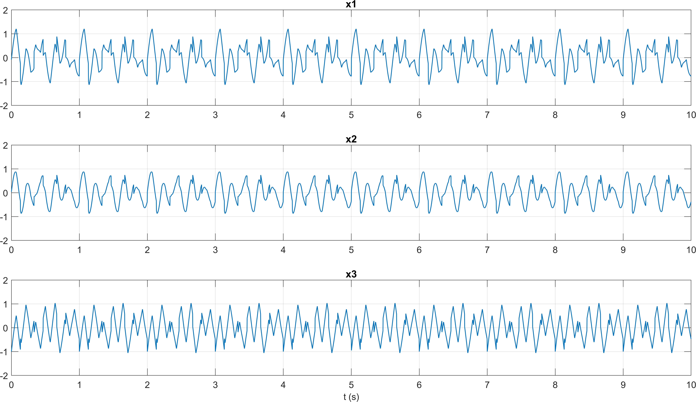
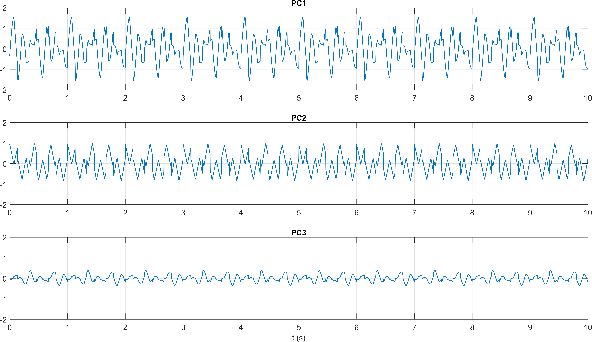
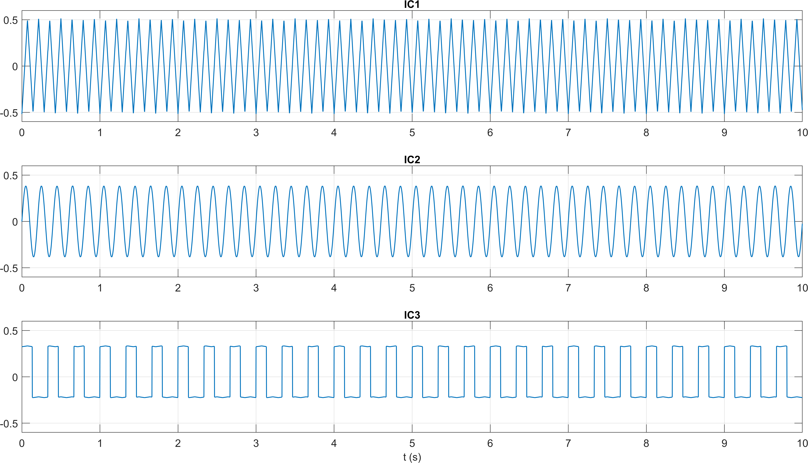
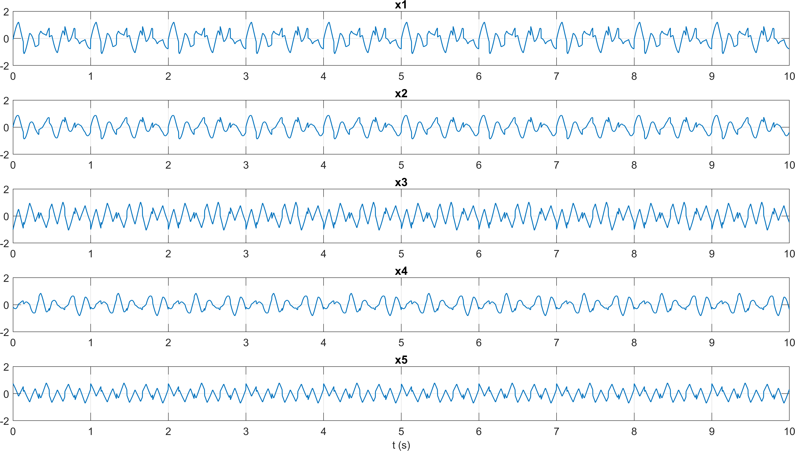
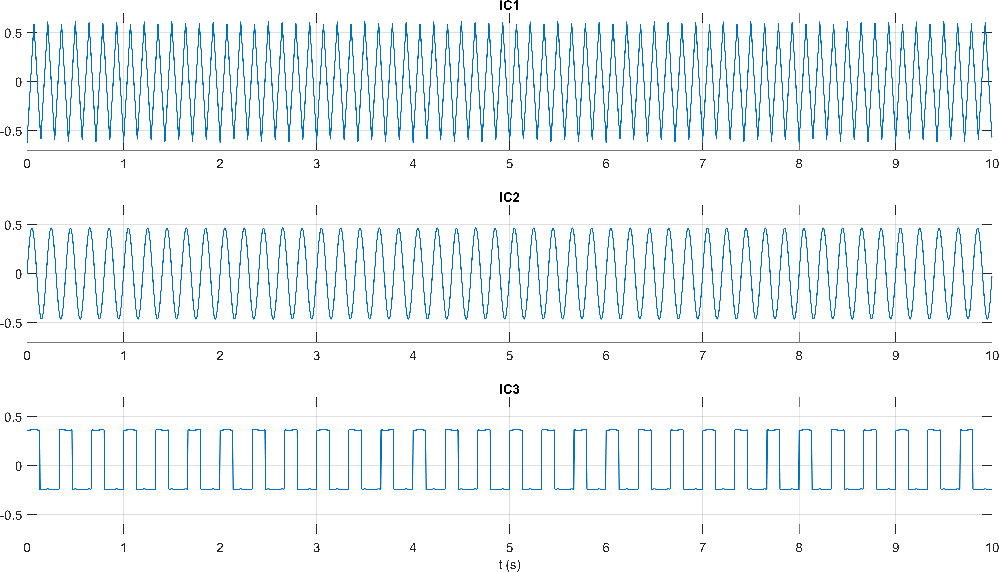
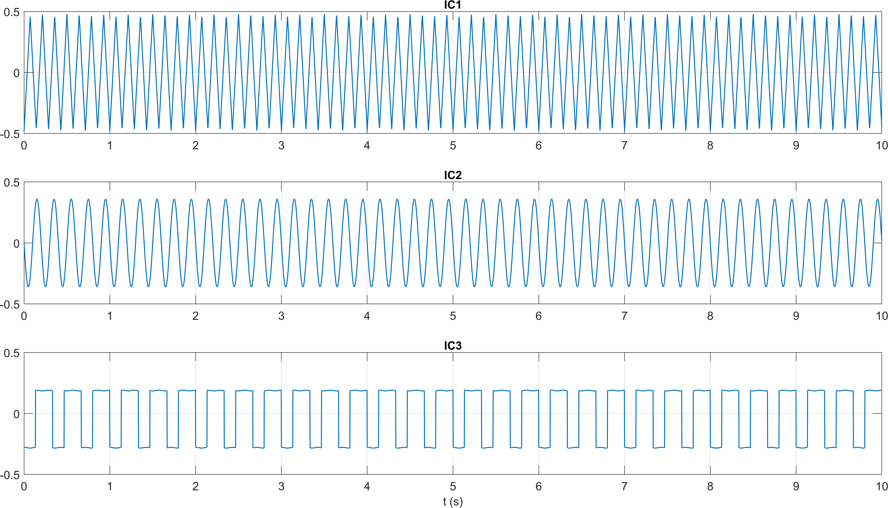

# Report: Exercise 2 - PCA and ICA on Synthetic Mixtures

## Objective
Study the difference between Principal Component Analysis (PCA) and Independent Component Analysis (ICA) for source separation, using synthetic signals with known ground truth.

## Exercise Setup 
- Duration: 10 s
- Sampling frequency: 500 Hz
- Independent sources:
  - `s1`: sinusoid (5 Hz, amplitude 0.75)
  - `s2`: triangle wave (7 Hz, amplitude 1)
  - `s3`: square-like wave (3 Hz, amplitude 0.5, duty 40%)
- Signals are centered before mixing.

## Method (Point-by-Point)
1. Generated three centered independent sources and mixed them with a `3x3` mixing matrix.
2. Plotted original sources and observed mixtures.
3. Computed PCA via covariance eigendecomposition and plotted the principal components.
4. Exported/loaded EEGLAB demixing matrix for the `3-variable` case and reconstructed ICs.
5. Built an overdetermined case by mixing the same 3 sources into `5 observed variables` (`5x3` mixing matrix).
6. Computed PCA on the 5-variable set and inspected component variances.
7. Kept the first 3 PCs (`Y3`) and applied ICA in EEGLAB on this reduced space.
8. Also evaluated EEGLAB ICA with internal PCA option (`'PCA',3`) directly on the 5-variable dataset.

## Results and Figure Mapping
### Figure 1 - Original sources and 3-variable mixtures

### Figure 2 - PCA on 3-variable mixtures

### Figure 3 - ICA on 3-variable mixtures

### Figure 4 - 5-variable mixtures

### Figure 5 - PCA on 5-variable mixtures

### Figure 6 - ICA on first 3 PCs (`Y3`)

### Figure 7 - ICA with EEGLAB internal PCA (`'PCA',3`)

### Figure 8 - Additional ICA/PCA separation output

## Discussion
- PCA decorrelates the observed variables and orders components by variance, but does not generally recover the original independent generators.
- ICA uses higher-order statistics and better matches the morphology of the true sources (up to scale/sign/permutation ambiguity).
- In the 5-variable overdetermined case, PCA is useful to reduce dimensionality to the effective source dimension (`3`) before ICA.
- EEGLAB internal PCA (`'PCA',3`) and explicit PCA-then-ICA are consistent approaches for this scenario.

## Conclusion
Exercise 2 confirms the complementary roles of PCA and ICA:
- PCA is effective for compact representation and dimensionality reduction.
- ICA is the key step for recovering statistically independent latent sources from linear mixtures.

