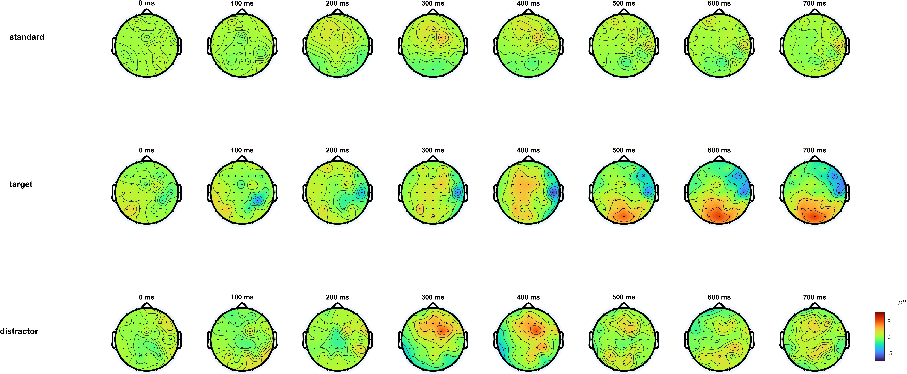
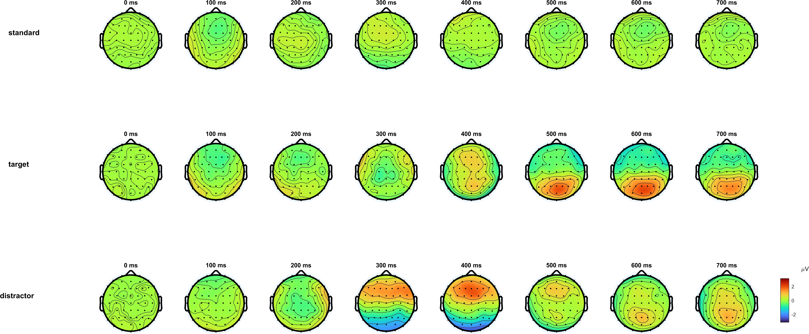

# Report: Exercise 8a and 8b - ERP Averaging (WSA and GA)

## Objective
Exercise 8 quantifies event-related activity after preprocessing by comparing ERP responses for:
- `standard`,
- `target`,
- `distractor`.

Two analysis levels are used:
- **Exercise 8a:** Within-Subject Averages (WSA),
- **Exercise 8b:** Grand Average (GA) across subjects.

## Methodological Context
The goal is to improve signal-to-noise ratio while preserving the neural signal of interest.  
In ERP analysis, averaging across repeated trials is the main denoising step: stimulus-locked components add constructively, while non-locked fluctuations are attenuated.

This exercise starts from `PreprocessStep2` outputs, meaning data are already cleaned, re-referenced, and epoched before ERP-specific averaging.

## Inputs
- `sub-035_PreprocessStep2.mat`, `sub-003_PreprocessStep2.mat`: single-subject epoched EEG (`60 x 500 x trials`).
- `WSA_allsubjects.mat`: condition-specific WSA across all subjects, used for GA.
- `Standard-10-20-Cap60.locs`: channel geometry for scalp interpolation.
- `erp_single_subject_solution.m`, `erp_group_solution.m`: reference scripts.

## Exercise 8a - Single-Subject ERP (WSA)
### Pipeline
1. Load one subject (`sub-035` in the current script setup).
2. Apply baseline correction using the pre-stimulus window from `-200 to 0 ms` (samples `1:101`).
3. Split epochs by condition with `stim_types`.
4. Compute condition-wise WSA by averaging over trials.
5. Plot ERP waveforms at:
- `Fz` (channel 12),
- `Cz` (channel 30),
- `Pz` (channel 47).
6. Build topographic maps from `0` to `700 ms` every `100 ms`, each map averaged over a `100 ms` local window (`center +/- 50 ms`).

### Why baseline correction matters
Baseline removal shifts each epoch relative to its own pre-stimulus mean, reducing slow offsets and making condition differences after `0 ms` more comparable across trials.

### Figures

### Interpretation (8a)
- Waveforms show condition-dependent divergence after stimulus onset.
- Late positive activity is stronger for target than standard, especially over centro-parietal sites (consistent with oddball-like processing).
- Topomaps confirm that effects are not only temporal but also spatial, with stronger posterior/centro-parietal positivity in later windows.

## Exercise 8b - Group-Level ERP (GA)
### Pipeline
1. Load all-subject WSA arrays.
2. Compute GA for each condition by averaging over subjects.
3. Plot GA waveforms at `Fz`, `Cz`, `Pz`.
4. Plot GA scalp maps with the same temporal sampling as 8a.

### Figures

### Interpretation (8b)
- GA reduces subject-specific variability and highlights robust population-level responses.
- The target condition keeps the clearest late positive deflection relative to standard/distractor.
- The GA topography supports a distributed centro-parietal dominance in the later post-stimulus period, matching canonical ERP expectations.

## WSA vs GA (Key Difference)
- **WSA (8a):** preserves subject-specific morphology and amplitude.
- **GA (8b):** emphasizes effects stable across subjects, typically with smoother and less noisy traces.
