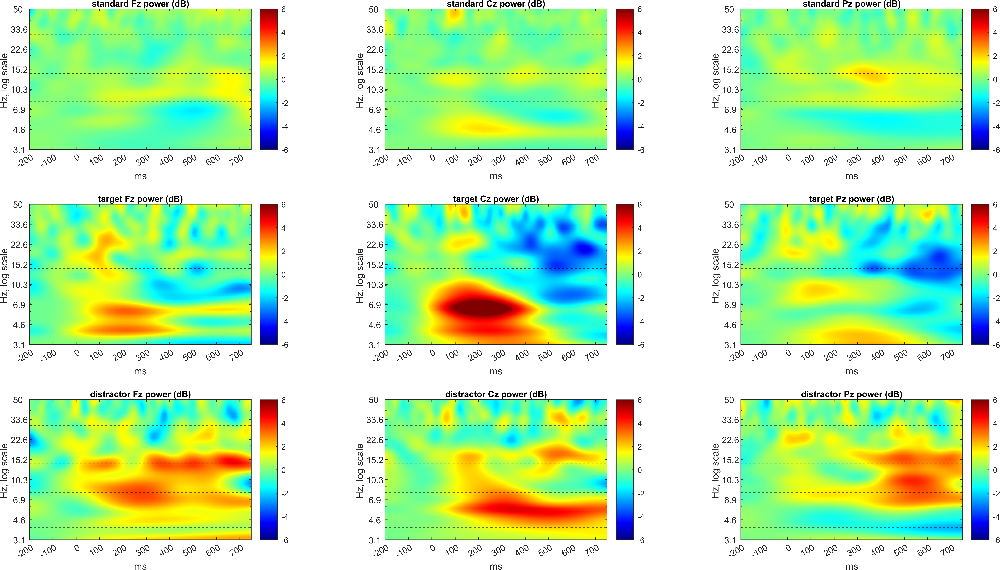
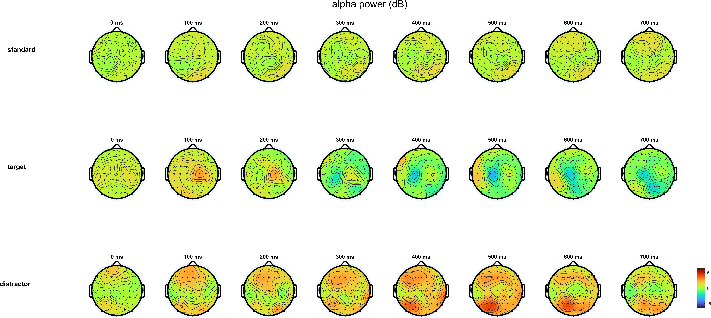
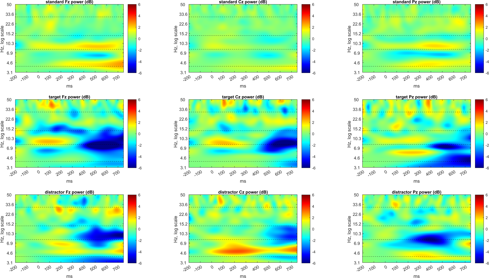
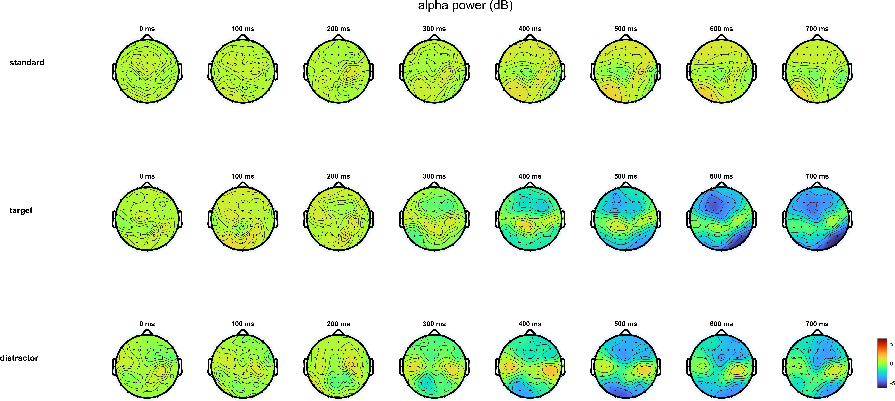
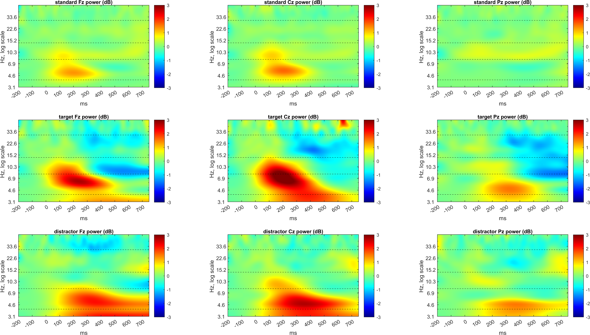
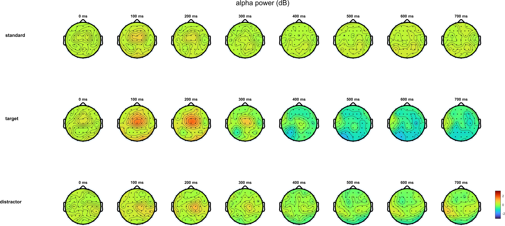

# Report: Exercise 9a and 9b - Time-Frequency Analysis with CWT

## Objective
Exercise 9 extends ERP analysis to the time-frequency domain and focuses on condition-dependent oscillatory changes in a 3-stimulus oddball task:
- `standard`,
- `target`,
- `distractor`.

The main physiological marker discussed in the lab notes is **alpha-band (8-14 Hz) desynchronization**, interpreted as attention-related activation.

## Data and Inputs
- `sub-003_PreprocessStep2.mat`, `sub-035_PreprocessStep2.mat`: single-subject cleaned EEG epochs (`60 x 500 x q`).
- `TF_Power_GA.mat`: precomputed group-level time-frequency power.
- `Standard-10-20-Cap60.locs`: channel locations for topoplots.
- `Exercise9a_Solution.m`, `Exercise9b_Solution.m`, `TF_colormap.m`.

## Methods
### 9a: Within-subject time-frequency analysis
1. Load one preprocessed subject dataset.
2. Apply baseline correction in each epoch and channel using `-200 to 0 ms` (samples `1:101`).
3. Split epochs by stimulus type.
4. Compute CWT (`amor`) for every channel and epoch with frequency range `3.125-50 Hz`:
- 4 octaves,
- 10 voices/octave,
- 41 frequency bins.
5. Convert coefficients to power: `abs(C).^2`.
6. Average power across epochs separately for each condition.
7. Normalize power at each frequency by its baseline mean (ERSP-style normalization).
8. Plot:
- 3x3 TF maps at Fz/Cz/Pz (rows = conditions),
- 3x8 alpha topomaps from `0` to `700 ms` in `100 ms` steps.

### 9b: Group-level time-frequency analysis
1. Load `TF_Power_GA.mat`.
2. Plot TF maps at Fz/Cz/Pz for the three conditions.
3. Extract alpha band (`8-14 Hz`) and plot topographic evolution (`0-700 ms`).

## Results
### 9a - Subject 003

Interpretation:
- Alpha decrease (blue) appears mainly in the **target** condition, around late post-stimulus latency (about 400 ms onward).
- Topography suggests central/parietal involvement during target processing.

### 9a - Subject 035

Interpretation:
- Alpha desynchronization is visible earlier (around 300 ms), strongest in target and slightly present in distractor.
- Effects are clear at fronto-central and parietal regions in the alpha topomaps.

### 9b - Grand Average (all subjects)

Interpretation:
- At group level, alpha decrease is most evident for **target** trials (around 400 ms onward), particularly at frontal/parietal electrodes.
- Alpha topomaps show stronger posterior-parietal desynchronization in target compared with standard/distractor.

## Discussion
- The TF analysis complements ERP analysis by showing **when** and **at which frequencies** condition differences occur.
- Target-related alpha desynchronization is consistent with increased attentional engagement in oddball paradigms.
- Subject-level outputs show inter-subject variability (timing and spatial extent), while GA emphasizes stable population trends.
