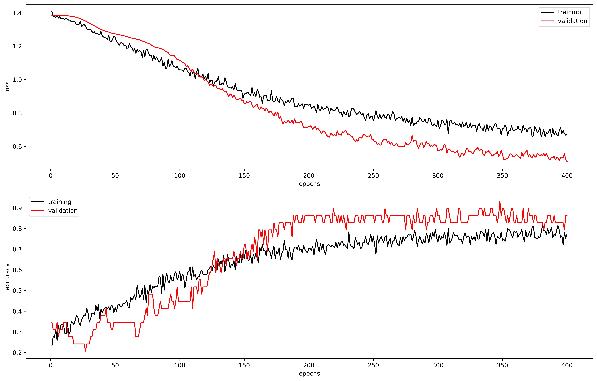
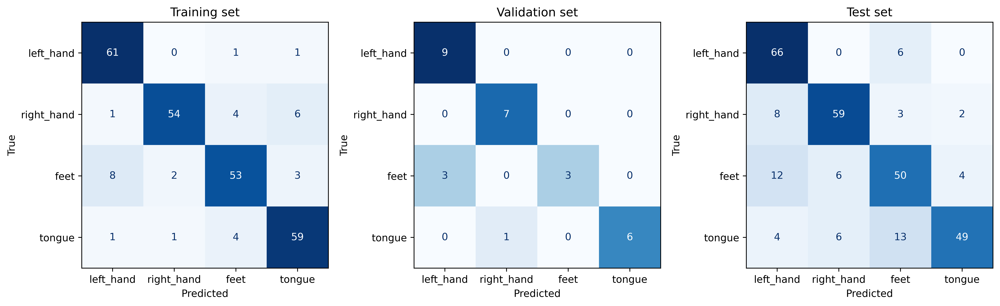

# Report: Exercise 10 - Motor Imagery Classification with EEGNet (Python)

## Objective
Train a convolutional neural network (EEGNet) to classify single-trial motor imagery EEG into 4 classes:
- left hand,
- right hand,
- feet,
- tongue.

## Data and Preprocessing
Dataset: BCI IV2a subject 008 (provided `.mat` file in the Python utilities folder).

Main preprocessing and split steps:
1. Load train/test sessions with `load_bci_iv2a`.
2. Reshape each trial from `(22, 256)` to `(22, 256, 1)`.
3. Convert labels to one-hot encoding.
4. Extract validation set from the first 10% of training trials.
5. Standardize all sets using training-set mean and standard deviation.
6. Inspect class counts per split.

## Model and Training
Model: EEGNet

Training setup used in the executed run:
- optimizer: SGD with momentum,
- learning rate: `0.001`,
- momentum: `0.9`,
- batch size: `32`,
- max epochs: `400`,
- best checkpoint selected on validation loss.

## Figures
### Class Distribution per Split

Figure explanation:
- The split is reasonably balanced across the 4 classes in train, validation, and test sets.
- This supports the use of overall accuracy and confusion matrices without strong class-imbalance bias.

### Training Curves (Loss and Accuracy)

Figure explanation:
- Loss decreases steadily and validation loss follows the same trend, indicating stable optimization.
- Accuracy rises on both sets with a limited train-validation gap, suggesting controlled overfitting.

### Confusion Matrices (Train/Validation/Test)

Figure explanation:
- Training and validation confusion matrices are strongly diagonal, confirming good internal fit.
- Test matrix remains mostly diagonal but shows harder separations for some classes (notably classes 3 and 4), which drives the expected drop from validation to test accuracy.
- This behavior is consistent with session/domain shift effects in BCI IV2a.

### Spatial Filter Importance by Channel

Figure explanation:
- The barplot shows channel-wise contribution derived from absolute/averaged spatial-filter weights in EEGNet.
- Higher-weight channels are concentrated in central/centro-parietal regions, which is coherent with motor-imagery physiology highlighted in the exercise PDF.

## Quantitative Results
From the executed Python run:
- training accuracy: `0.8764`
- validation accuracy: `0.8621`
- test accuracy: `0.7778`

Interpretation:
- The model learns stable discriminative patterns (high train/validation scores).
- Test performance remains solid but lower than train/validation, indicating expected domain/generalization difficulty on held-out session data.
- Spatial-weight aggregation supports neurophysiological plausibility of the learned solution (motor-area relevance).
