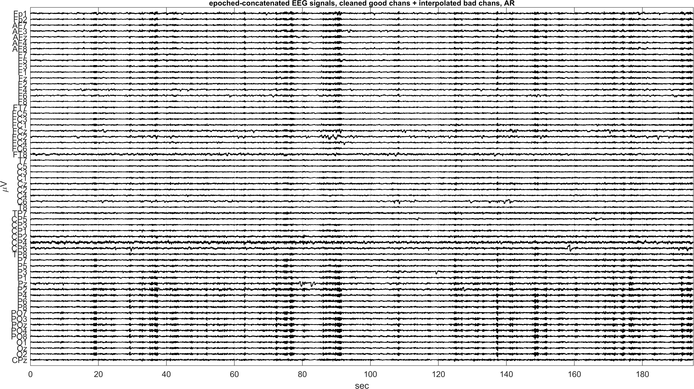
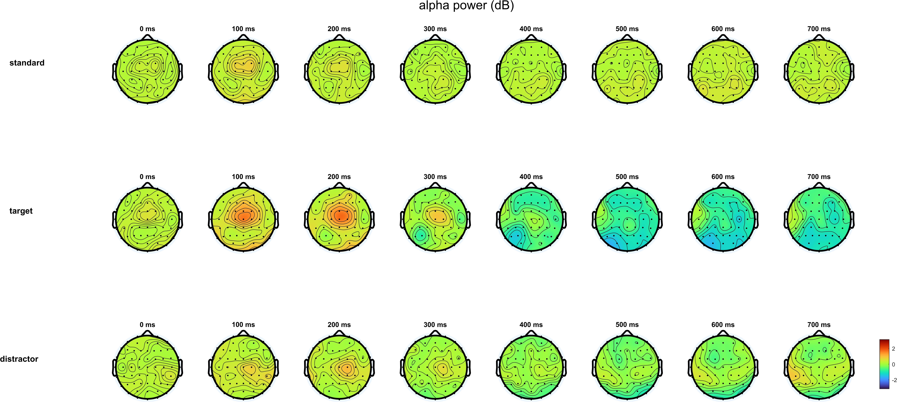

# EEG Processing

EEG signal-processing workflow for offline preprocessing and classical analysis of resting-state and oddball-style recordings. The repository is organized around a practical MATLAB pipeline for filtering, epoching, bad-channel screening, ICA-based artifact handling, ERP estimation, and time-frequency analysis, with saved intermediate datasets and representative figures kept alongside the analysis code.

The emphasis is methodological clarity rather than novelty claims: this is a compact end-to-end EEG methods project, not a benchmark dataset release or a general-purpose software framework. Motor-imagery decoding that previously appeared in this repository has been moved to a separate project so the scope here stays focused on preprocessing and classical EEG analysis.

## Project Scope

- preprocessing from raw EEG to `PreprocessStep1`
- ICA-centered artifact analysis across several recording configurations
- completion of the main preprocessing branch to cleaned `PreprocessStep2` datasets
- within-subject and group-level ERP analysis
- within-subject and group-level time-frequency analysis using continuous wavelet transforms
- a small appendix on PCA/ICA source-separation concepts

## Workflow

1. `pipeline/01_preprocessing`
   Detrending, filtering, event alignment, epoch extraction, and bad-channel screening.

2. `pipeline/02_artifact_removal_ica`
   ICA case studies plus pipeline completion to cleaned, re-referenced `PreprocessStep2` outputs.

3. `pipeline/03_erp_analysis`
   Within-subject and grand-average ERP estimation with waveform and scalp-topography summaries.

4. `pipeline/04_time_frequency_analysis`
   CWT-based power analysis with subject-level spectrograms and group-level alpha summaries.

5. `appendix/ica_source_separation_concepts`
   Supporting method-development note kept outside the core analysis path.

## Outputs

| Workflow stage | Main saved outputs | Analysis level |
| --- | --- | --- |
| Preprocessing | `sub-035_PreprocessStep1.mat`, preprocessing QC figures | Single-subject |
| ICA and pipeline completion | `sub-003_PreprocessStep2.mat`, `sub-035_PreprocessStep2.mat`, IC inspection and cleaning figures | Single-subject |
| ERP analysis | within-subject ERP figures, `WSA_allsubjects.mat`, grand-average ERP figures | Single-subject and group-level |
| Time-frequency analysis | subject-level CWT figures, `TF_Power_GA.mat`, grand-average alpha/topography figures | Single-subject and group-level |

## Representative Figures


Filtering quality-control view used during preprocessing.


Example artifact-removal result from the preprocessing-completion branch.


Grand-average ERP scalp summary for the oddball branch.


Group-level alpha-band topography from the CWT workflow.

## Repository Layout

```text
EEG-Processing/
|-- pipeline/
|   |-- 01_preprocessing/
|   |-- 02_artifact_removal_ica/
|   |-- 03_erp_analysis/
|   `-- 04_time_frequency_analysis/
|-- appendix/
|   `-- ica_source_separation_concepts/
|-- scripts/
|   |-- run_preprocessing.m
|   |-- run_ica_workflows.m
|   |-- run_erp_analysis.m
|   |-- run_time_frequency_analysis.m
|   |-- run_full_pipeline.m
|   `-- validate_outputs.m
`-- README.md
```

## Requirements

- MATLAB
- Signal Processing Toolbox
- EEGLAB for IC inspection, scalp maps, and interpolation-dependent steps

The repository is intended as a reproducible research workflow with MATLAB scripts, preserved intermediate datasets, and curated outputs. It is not packaged as a standalone EEG toolbox.

## Usage

Run the workflow from the repository root in MATLAB:

```matlab
addpath('scripts');
run_preprocessing();
run_ica_workflows(true);
run_erp_analysis();
run_time_frequency_analysis();
```

Or run the full sequence:

```matlab
addpath('scripts');
run_full_pipeline(true);
```

Check for expected artifacts:

```matlab
addpath('scripts');
validate_outputs();
```

## Notes

- Each workflow directory includes a local `README.md` describing inputs, outputs, and representative figures.
- Outputs are stored next to the scripts that generate them so preprocessing decisions remain easy to trace.
- The repository favors readability and reproducibility over heavy abstraction.
