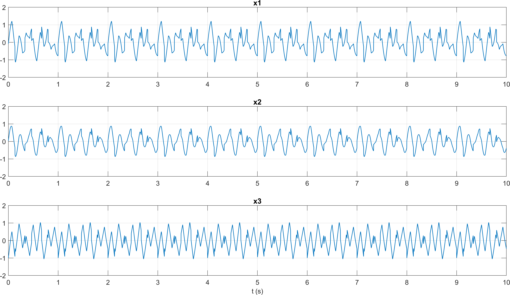
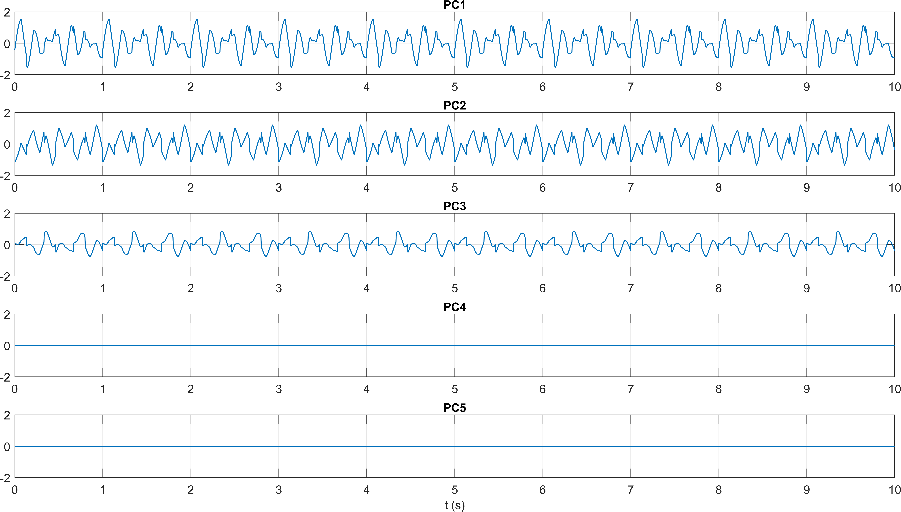

# PCA and ICA Source-Separation Concepts

Method-development note on the behavior of PCA and ICA in synthetic source mixtures with known ground truth.

## Main Script

- `pca_ica_synthetic_mixtures.m`

## Purpose

This appendix supports the main repository by showing why ICA is useful for EEG artifact handling and source separation. It is not presented as a separate flagship project; it is included as a compact methodological supplement.

## Processing Summary

1. Generate three independent synthetic sources.
2. Mix them into observed signals under square and overdetermined settings.
3. Compare PCA projections with ICA recovery.
4. Inspect how PCA can help reduce dimensionality before ICA.

## Representative Figures

## Notes

The appendix is useful context for the ICA-driven cleaning workflows in the main pipeline, but it is intentionally de-emphasized relative to the end-to-end EEG analysis path.
