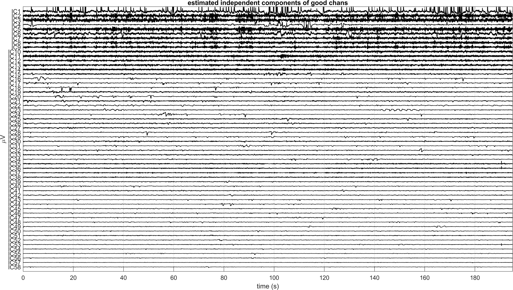
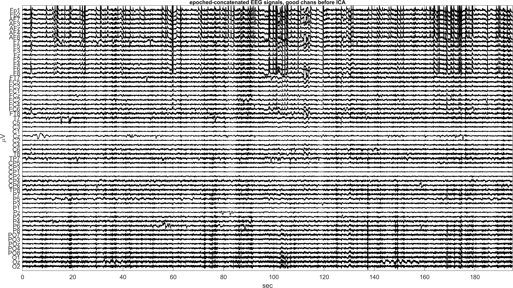
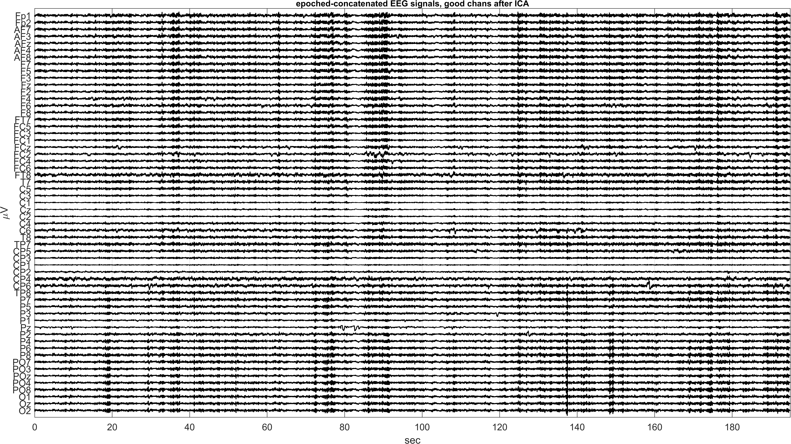
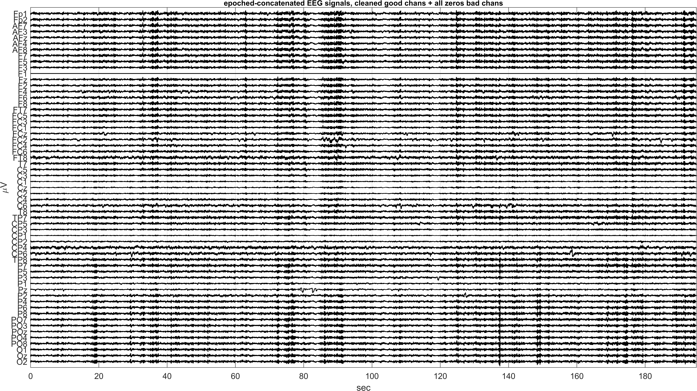
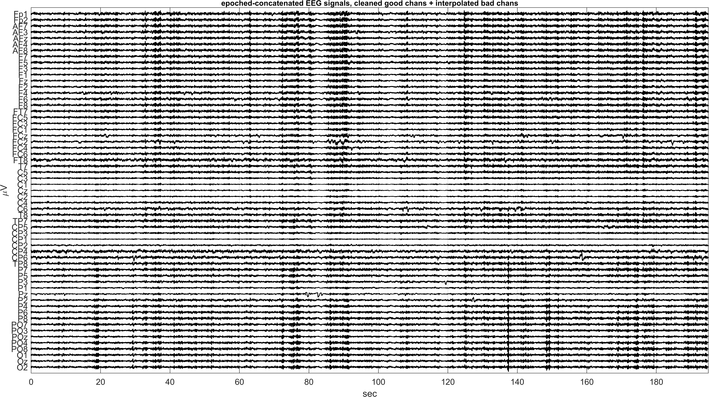
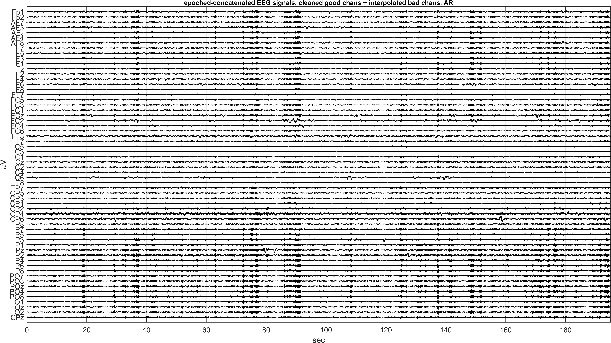
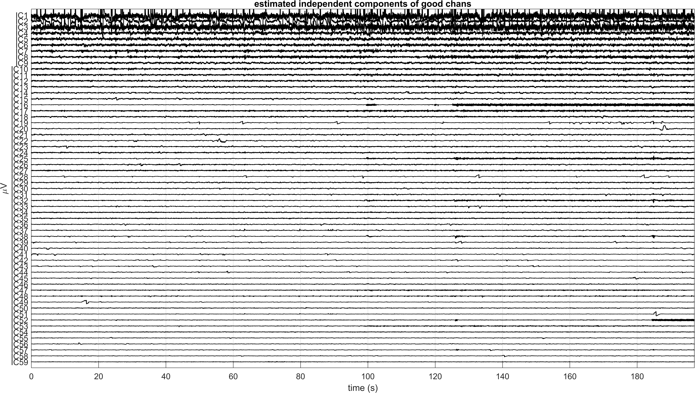
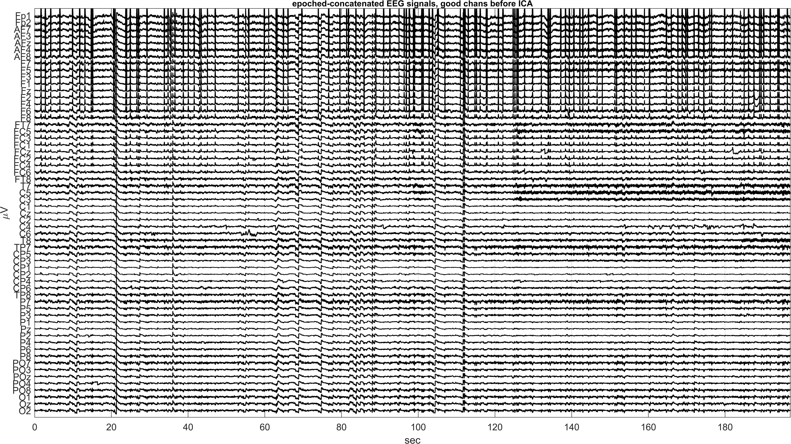
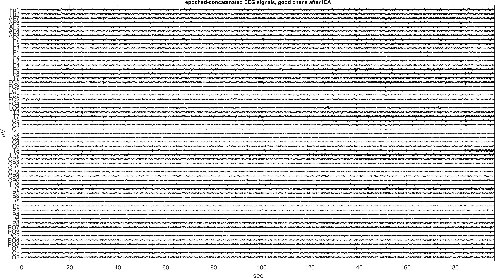

# Report: Exercise 7 - Completion of Preprocessing Pipeline (Sub-035 and Sub-003)

## Objective
Complete the preprocessing chain started in Exercise 1 by:
- ICA cleaning on good channels,
- bad-channel handling/interpolation (when present),
- average re-referencing with recovery of CPz,
- conversion from 2D epoch-concatenated data back to 3D epoched format.

## Input Context
Exercise 7 starts from Exercise 1 outputs (`*_PreprocessStep1.mat`) where data are already:
- detrended and filtered,
- epoched then concatenated,
- screened for bad channels.

Two subject workflows are included:
- Subject 035: `Exercise7_Subj035/Exercise7.m`
- Subject 003: `Exercise1_7_Subj003/Exercise7_Subj003.m` (optional branch)

## Workflow Summary
1. Load `PreprocessStep1` data.
2. Save/export for EEGLAB ICA.
3. In EEGLAB: estimate ICA and export demixing matrix (and IC maps).
4. Reconstruct IC activations (`Y = W*X`), inspect time traces.
5. Compute PSD of ICs.
6. Identify artifact ICs using temporal/spectral/spatial evidence.
7. Remove artifact ICs and reconstruct cleaned good-channel EEG.
8. (Sub-035) Add bad channel row back (zeros) for interpolation path.
9. (Sub-035) Interpolate bad channel in EEGLAB.
10. Re-reference to average reference and add recovered CPz.
11. Reshape 2D concatenated data to 3D (`channels x samples x epochs`) and save `PreprocessStep2`.

## Artifact Components Removed
### Subject 035
- Removed ICs: `1, 4, 6, 11, 14:25, 28, 29`
- Bad channel handling:
  - bad channel from Ex1 (`F1`, index 11) added back as zero row,
  - interpolated in EEGLAB before AR.

### Subject 003
- Removed ICs: `1, 2, 3, 11, 14, 15, 16, 17, 19, 20, 22, 25, 27, 28, 30`
- No bad channel detected in this subject, so interpolation steps were skipped.

## Results and Figures
### Subject 035 (6 figures)

### Subject 003 (4 figures)

## Conclusion
Exercise 7 completes the preprocessing pipeline for both subjects. The outputs are artifact-reduced, re-referenced, and reshaped into 3D epoched tensors ready for downstream ERP/time-frequency analysis. Subject-specific differences (presence/absence of bad channels) were handled correctly through the branching workflow.

