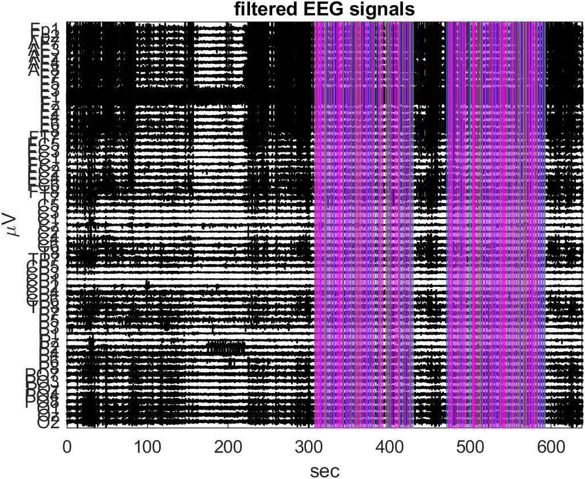
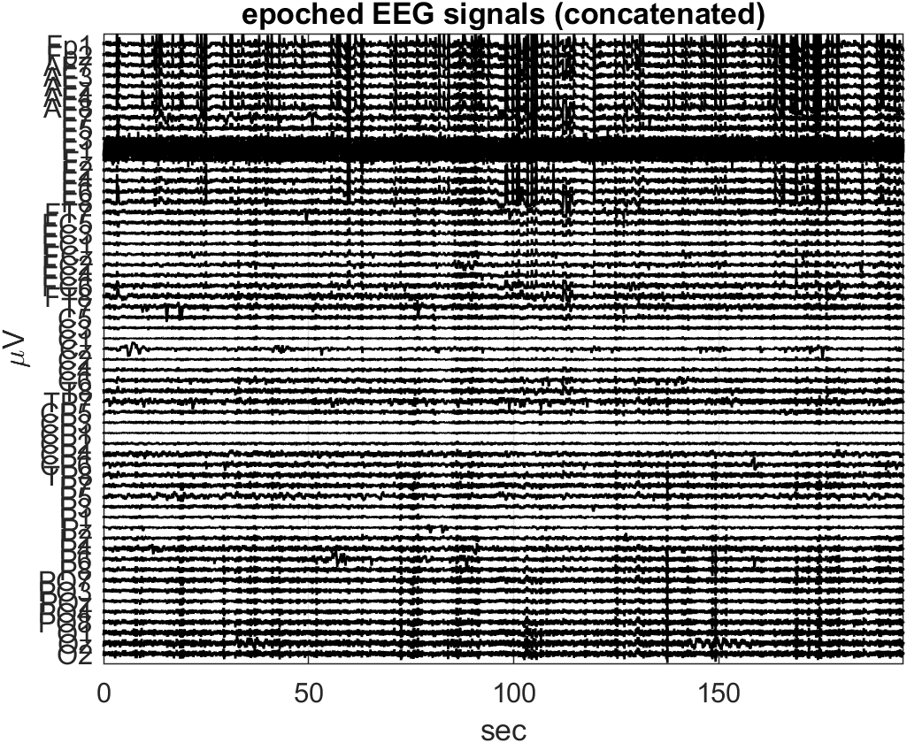
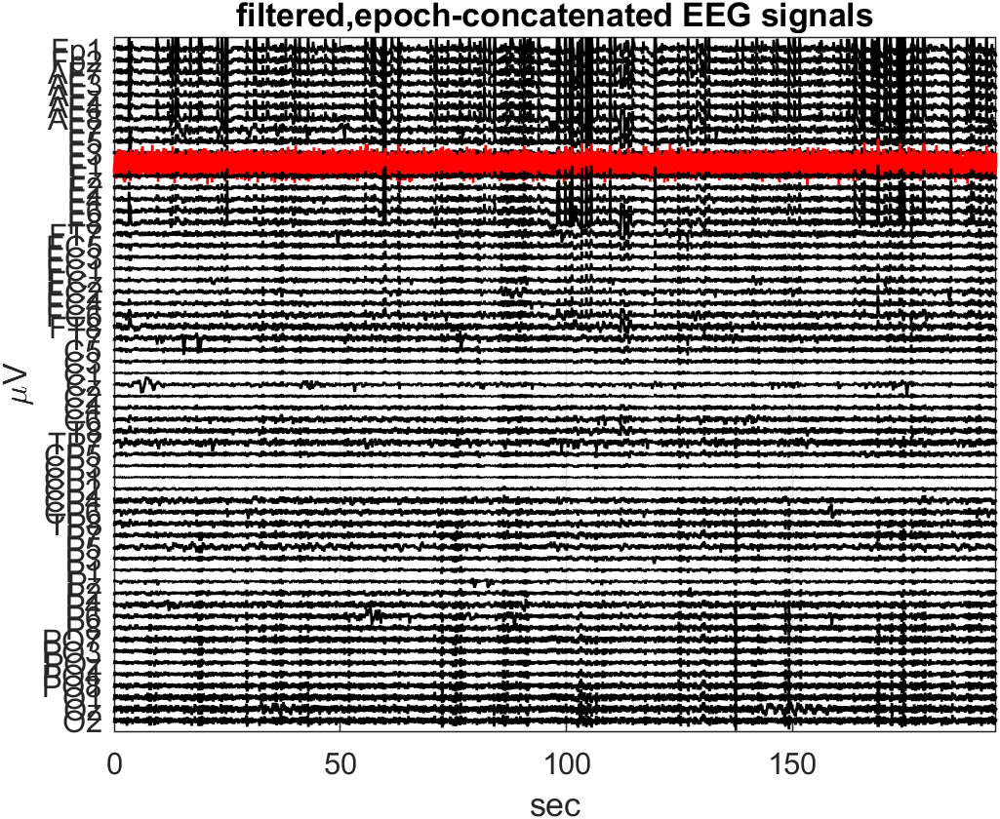

# Report: Exercise 1

## Objective
Preprocess multichannel resting-state EEG and evaluate spectral content before and after filtering.

## Method Summary
- Loaded raw EEG and converted data to double precision.
- Kept original sampling rate (no resampling in this run).
- Applied linear detrending.
- Estimated power spectral density (Welch method).
- Applied zero-phase IIR filtering:
  - low-pass,
  - high-pass,
  - notch at line frequency.
- Recomputed PSD for filtered signals to verify spectral cleanup.

## Results
The outputs show:
- organized multichannel EEG traces after detrending,
- channel-wise PSD structure before filtering,
- improvement in spectral quality after filtering steps.

## Conclusion
The pipeline produces clean baseline-preprocessed EEG and preserves interpretable channel-level spectral features for downstream ICA and ERP analyses.

