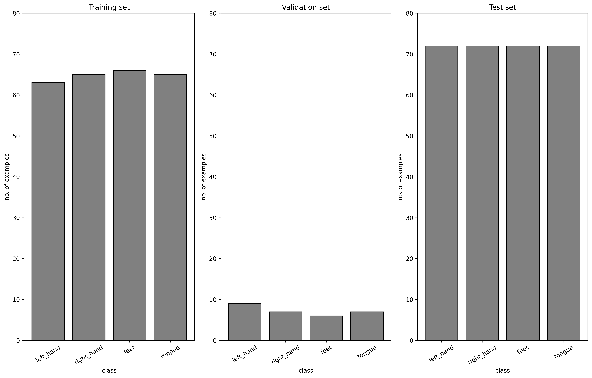
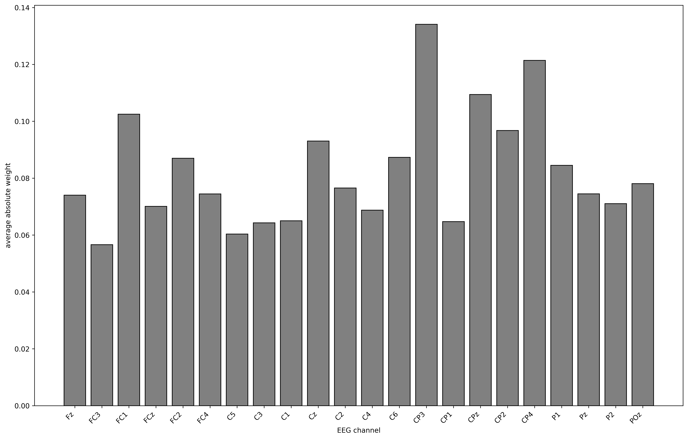

# Report: Exercise 10 - Motor Imagery Classification with EEGNet (Python)

## Objective
Train a convolutional neural network (EEGNet) to classify single-trial motor imagery EEG into 4 classes:
- left hand,
- right hand,
- feet,
- tongue.

## Data and Preprocessing
Dataset: BCI IV2a subject 008 (provided `.mat` file in the Python utilities folder).

Main preprocessing and split steps:
1. Load train/test sessions with `load_bci_iv2a`.
2. Reshape each trial from `(22, 256)` to `(22, 256, 1)`.
3. Convert labels to one-hot encoding.
4. Extract validation set from the first 10% of training trials.
5. Standardize all sets using training-set mean and standard deviation.
6. Inspect class counts per split.

## Model and Training
Model: EEGNet (`exercise10/python/exercise10_utils/utils.py`), as requested in the lab handout.

Training setup used in the executed run:
- optimizer: SGD with momentum,
- learning rate: `0.001`,
- momentum: `0.9`,
- batch size: `32`,
- max epochs: `400`,
- best checkpoint selected on validation loss.

## Figures
### Class Distribution per Split

### Training Curves (Loss and Accuracy)

### Confusion Matrices (Train/Validation/Test)

### Spatial Filter Importance by Channel

## Quantitative Results
From the executed Python run:
- training accuracy: `0.8764`
- validation accuracy: `0.8621`
- test accuracy: `0.7778`

Interpretation:
- The model learns stable discriminative patterns (high train/validation scores).
- Test performance remains solid but lower than train/validation, indicating expected domain/generalization difficulty on held-out session data.
- Spatial-weight aggregation highlights channels with higher contribution to class discrimination, consistent with the motor-imagery task rationale.

## Reproducibility
Execution script used for figure generation:
- `exercise10/python/run_exercise10_export.py`

Generated outputs:
- `exercise10/figures/exercise10_py_fig_001.png`
- `exercise10/figures/exercise10_py_fig_002.png`
- `exercise10/figures/exercise10_py_fig_003.png`
- `exercise10/figures/exercise10_py_fig_004.png`

