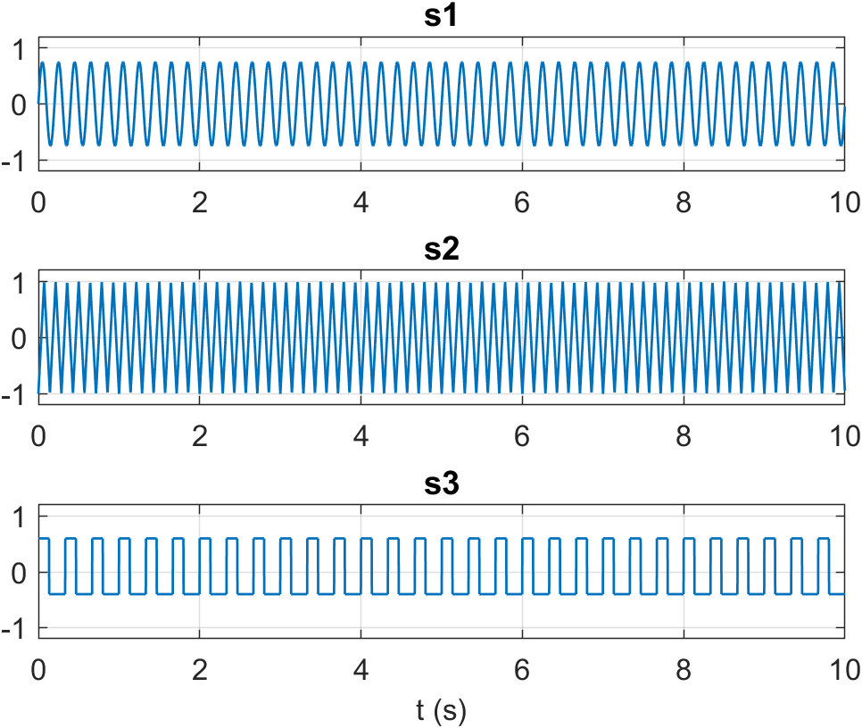
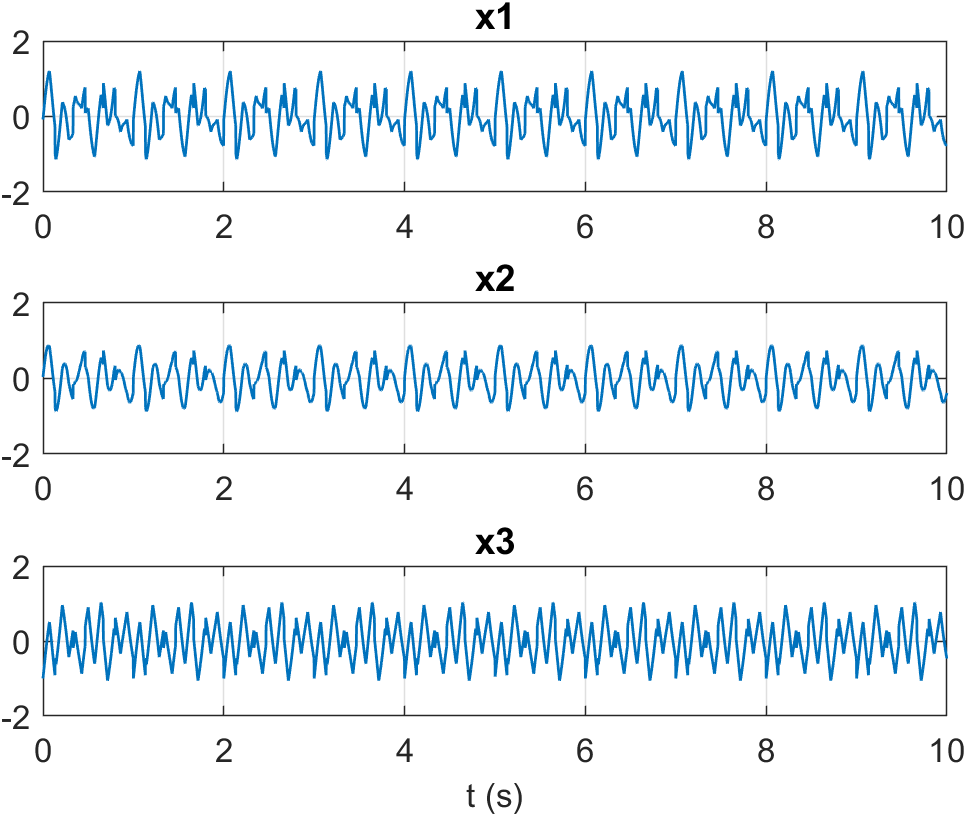
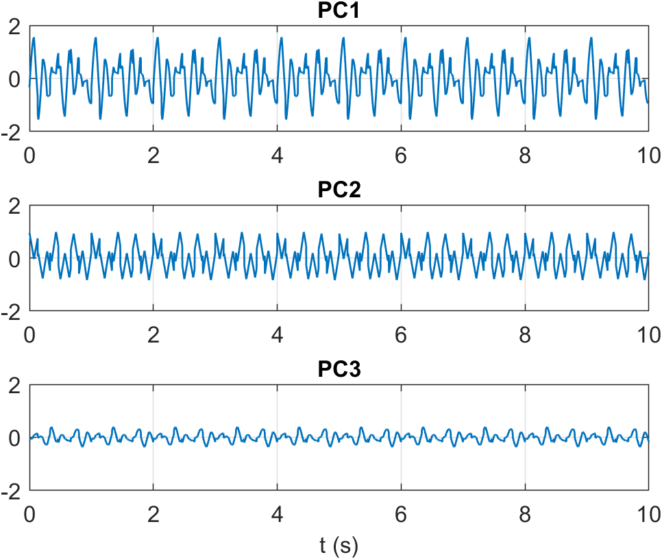
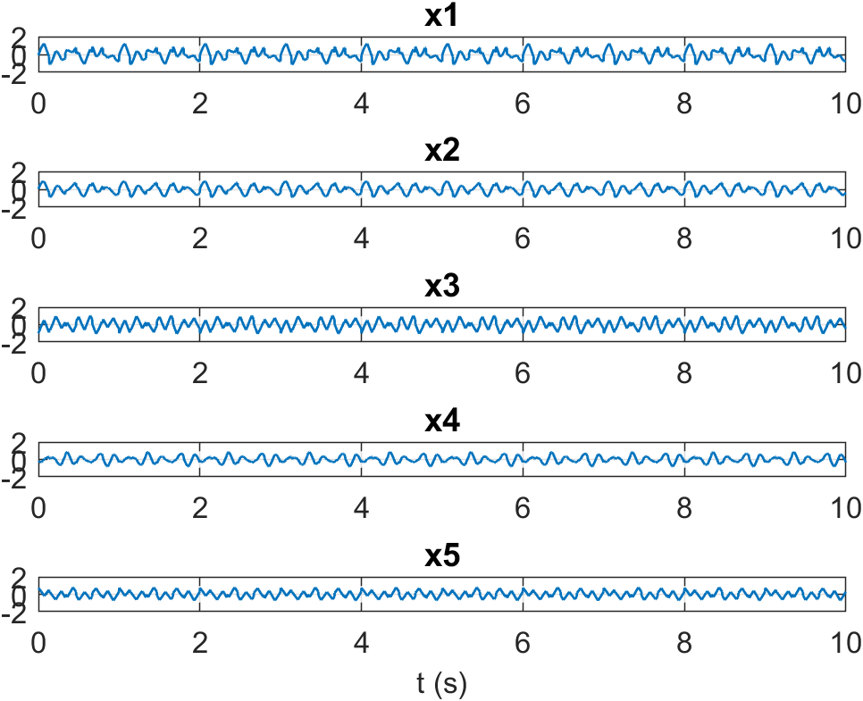
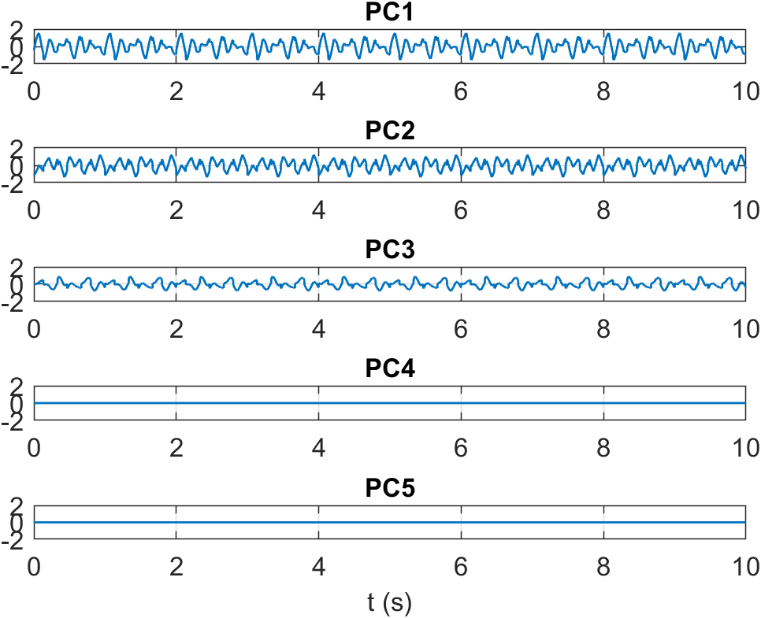
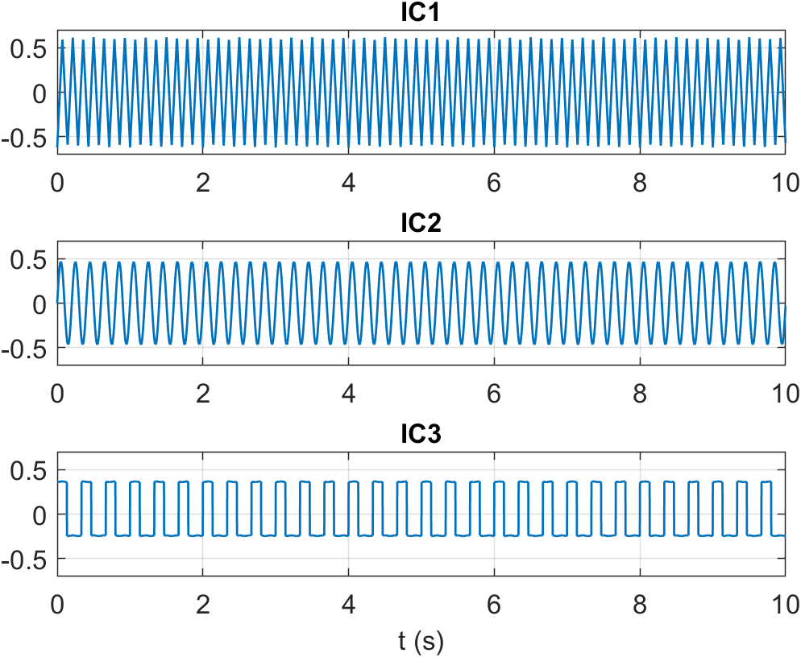
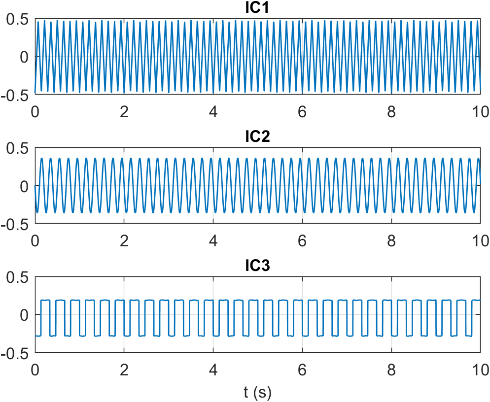

# Report: Exercise 2

## Objective
Evaluate PCA and ICA on synthetic mixtures of independent source signals.

## Method Summary
- Generated three independent sources (sinusoidal, triangular, square-like).
- Built linear mixtures with:
  - 3 observed channels,
  - 5 observed channels.
- Computed principal components through covariance eigendecomposition.
- Applied ICA demixing matrices exported from EEGLAB:
  - directly on mixed signals,
  - on reduced PCA subspace (first three PCs),
  - and with PCA reduction inside ICA.

## Results
The outputs show the expected behavior:
- PCA decorrelates mixtures but does not recover fully independent source waveforms.
- ICA recovers components with morphology closer to original generating signals.
- PCA-before-ICA works as dimensionality reduction for overdetermined mixtures.

## Conclusion
This exercise confirms the standard workflow for source separation: PCA for compact representation and ICA for approximate recovery of statistically independent latent generators.

