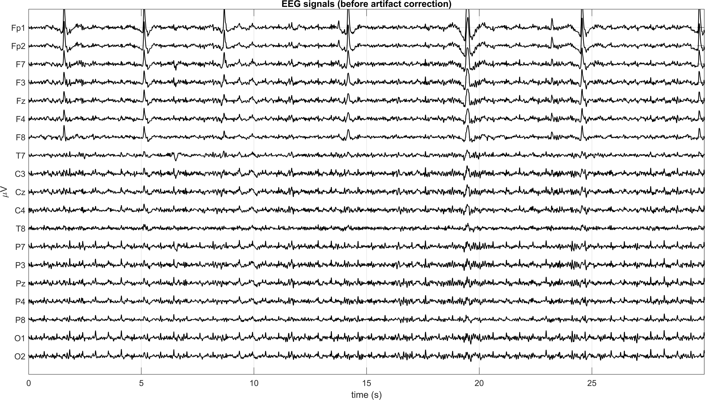
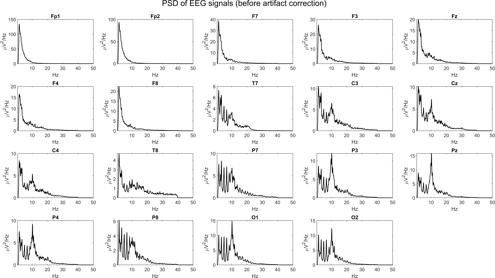
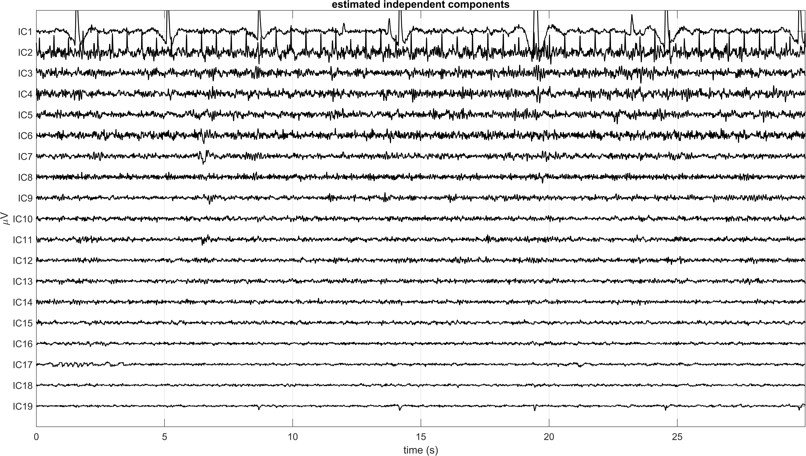
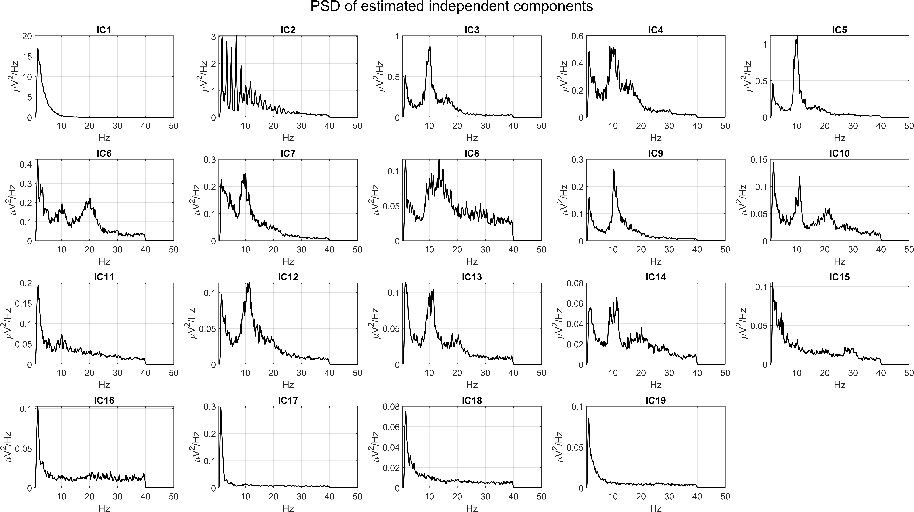
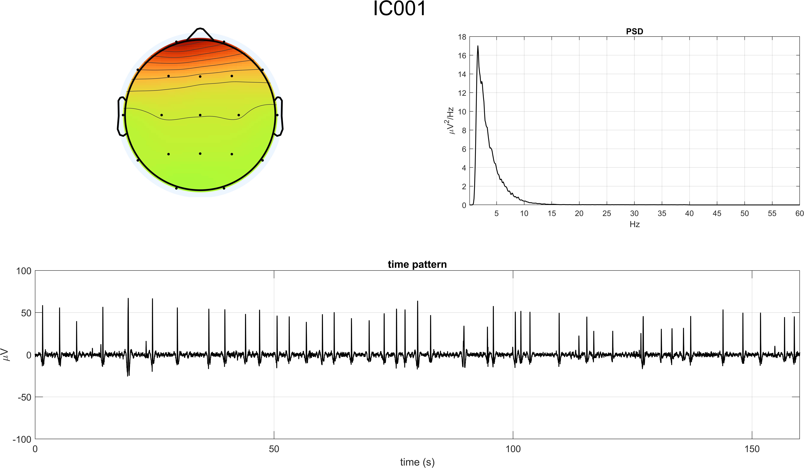
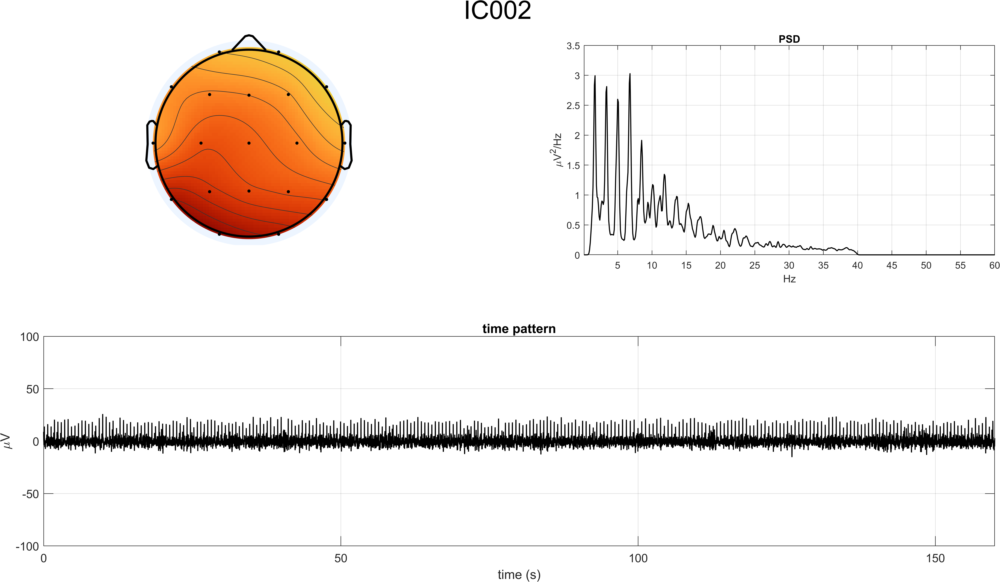
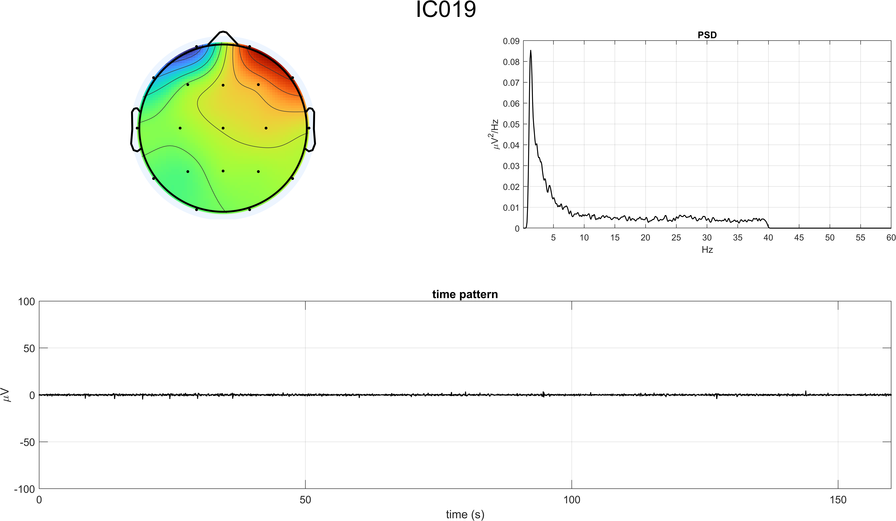
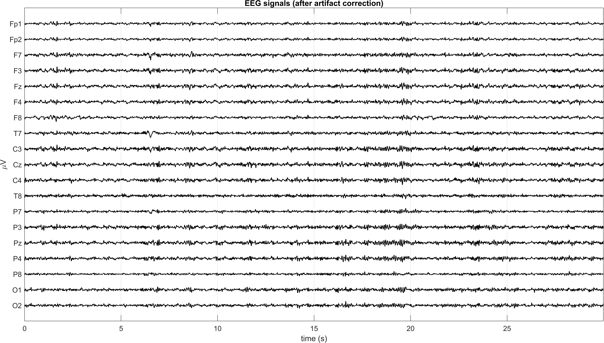
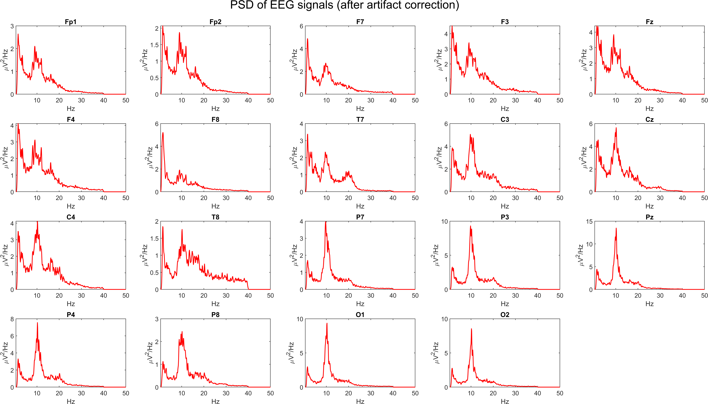
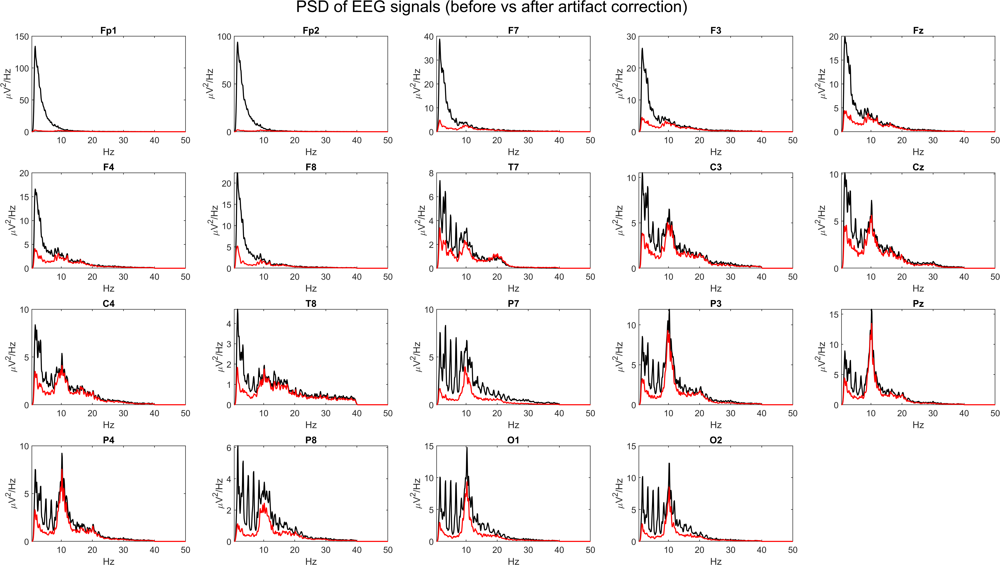

# Report: Exercise 3 - ICA Artifact Rejection (Eyes Open)

## Objective
Process 19-channel eyes-open resting EEG and remove major artifacts using ICA, then compare EEG time-domain and spectral behavior before vs after correction.

## Dataset and Inputs
- EEG file: `EYES_OPEN.mat`
- Channels: 19
- Sampling rate: 128 Hz
- Channel locations: `Standard-10-20-Cap19.locs`
- EEGLAB outputs used by script:
  - demixing matrix: `matrixW_Exercise3.txt`
  - IC scalp maps: `mapICs_Exercise3.fig`

## Procedure (Aligned with Exercise Points)
1. Loaded EEG and plotted first 30 s of raw signals.
2. Computed/visualized PSD of all EEG channels (`pwelch`).
3. Prepared `.mat` data export for EEGLAB import.
4. In EEGLAB: estimated ICA decomposition, exported demixing matrix, saved IC topomap figure.
5. Reconstructed IC time courses from `W*X`.
6. Computed/visualized PSD of all ICs.
7. Identified artifactual ICs from time course + PSD + topography.
8. Zeroed selected ICs, reconstructed cleaned EEG, and compared post-cleaning PSD to pre-cleaning PSD.

## Identified Artifact Components
From the provided solution and IC inspection:
- `IC1`: blinking-related activity
- `IC2`: cardiac (ECG-like) activity
- `IC19`: smaller lateral eye-movement contribution

Removed set in reconstruction: `IC1, IC2, IC19`.

## Results and Figures (All Exported Point-by-Point)
### Point 1 - Raw EEG (before correction)

### Point 2 - PSD of raw EEG channels

### Point 5 - Estimated ICs (time domain)

### Point 6 - PSD of estimated ICs

### Point 7 - Detailed IC inspection (time/PSD/topomap)

### Point 8 - Cleaned EEG and PSD comparison

## Interpretation
- ICA decomposition isolates non-neural components that are difficult to remove with standard filtering alone.
- Removing selected artifactual ICs visibly attenuates large-amplitude contaminations in frontal/ocular-sensitive channels.
- PSD comparison confirms spectral cleanup while preserving the main physiologic EEG content in the analysis band.

## Conclusion
Exercise 3 successfully applies ICA-based artifact correction on eyes-open EEG. The workflow from raw signal inspection to IC identification and selective IC rejection produces cleaner EEG in both time and frequency domains, preparing data for reliable downstream analyses.

