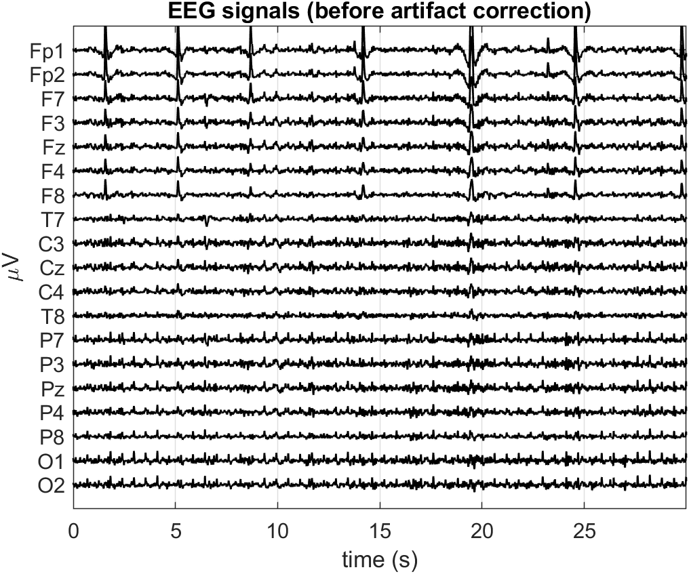
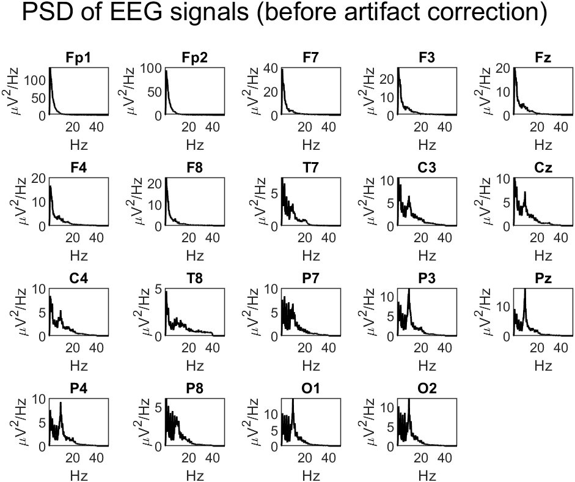
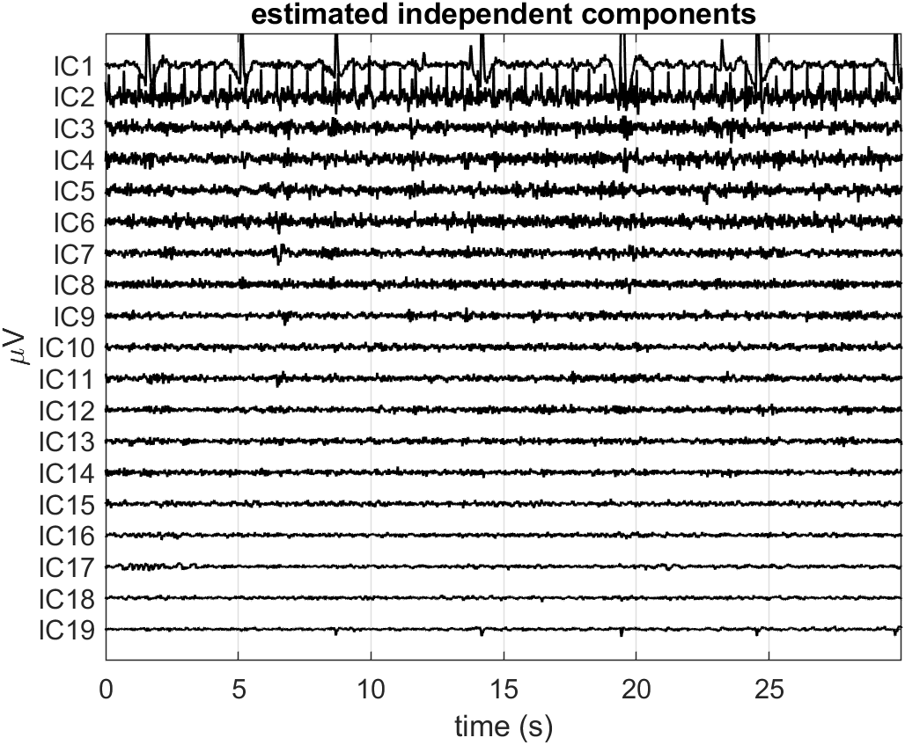
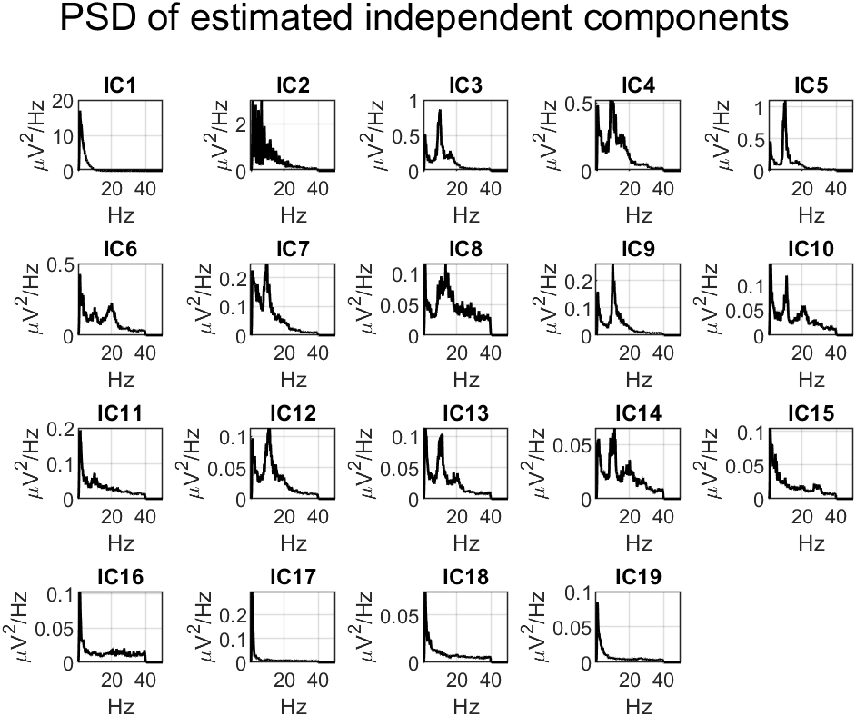
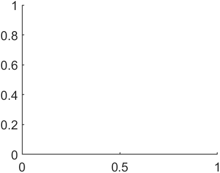

# Report: Exercise 3

## Objective
Clean eyes-open EEG through ICA-based artifact rejection and compare spectral profiles before and after correction.

## Method Summary
- Loaded 19-channel EEG recording (eyes open).
- Computed time traces and channel PSDs.
- Imported data into EEGLAB to estimate ICA demixing matrix.
- Reconstructed independent components and inspected:
  - temporal patterns,
  - PSDs,
  - scalp maps.
- Removed selected artifact ICs and reconstructed cleaned EEG.

Primary removed components in the provided solution: IC1, IC2, IC19.

## Results
The generated figures show:
- raw EEG and IC decomposition,
- spectral structure of ICs,
- cleaned EEG and PSD comparison.

## Conclusion
ICA separation supports effective artifact attenuation while preserving dominant physiological rhythms for later event-related or spectral analyses.

