# Report: Exercise 4 - ICA Artifact Rejection (Eyes Closed)

## Objective
Apply the same ICA-based cleaning workflow as Exercise 3 on eyes-closed EEG, then compare the resulting characteristics with the eyes-open condition.

## Dataset and Inputs
- EEG file: `EYES_CLOSED.mat`
- Channels: 19
- Sampling rate: 128 Hz
- Channel locations: `Standard-10-20-Cap19.locs`
- EEGLAB outputs used by script:
  - demixing matrix: `matrixW_Exercise4.txt`
  - IC topomap file: `mapICs_Exercise4.fig`

## Procedure (Aligned with Exercise Points)
1. Loaded eyes-closed EEG and plotted first 30 s.
2. Computed/visualized channel PSDs (`pwelch`).
3. Prepared data export for EEGLAB.
4. In EEGLAB: estimated ICA and exported demixing matrix.
5. Reconstructed IC time courses from `Y = W*X`.
6. Computed PSD of all ICs.
7. Inspected ICs via time pattern, PSD, and topography to identify artifacts.
8. Removed selected artifact ICs and reconstructed cleaned EEG, then compared pre/post PSD.

## Identified Artifact Components
Components removed in the provided solution:
- `IC1`
- `IC12` to `IC19`

Notes from script comments:
- `IC1` appears as the most evident ECG-like artifact.
- `IC12:IC19` include low-variance components with likely non-neural contamination (eye/muscle-related patterns).

## Results and Figures (All Exported Point-by-Point)
### Point 1 - Raw eyes-closed EEG
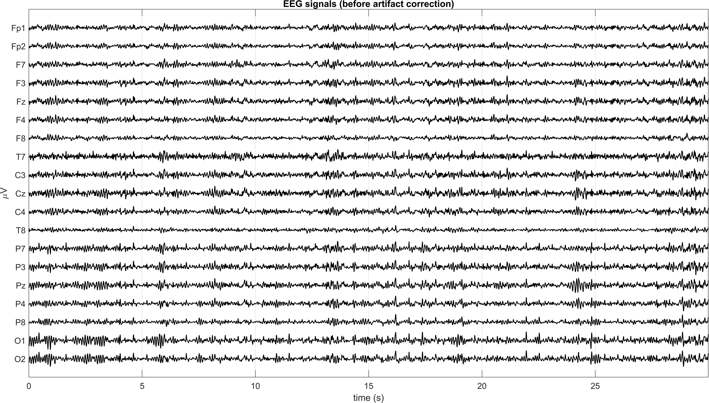

### Point 2 - PSD before correction
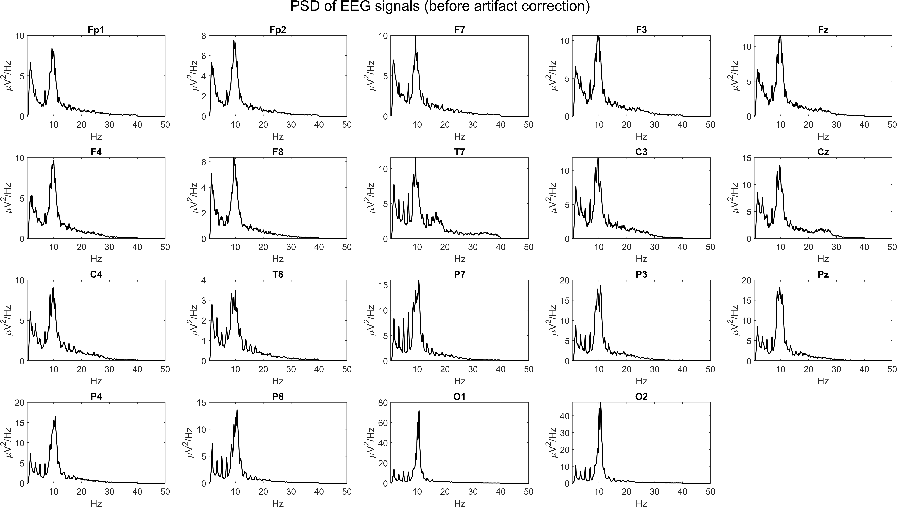

### Point 5 - Estimated ICs (time domain)
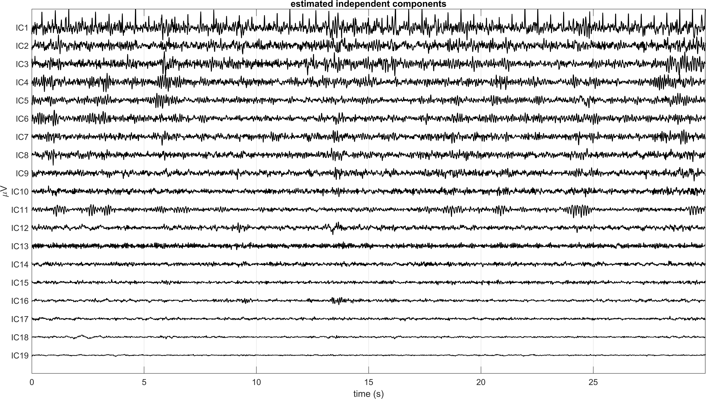

### Point 6 - PSD of ICs
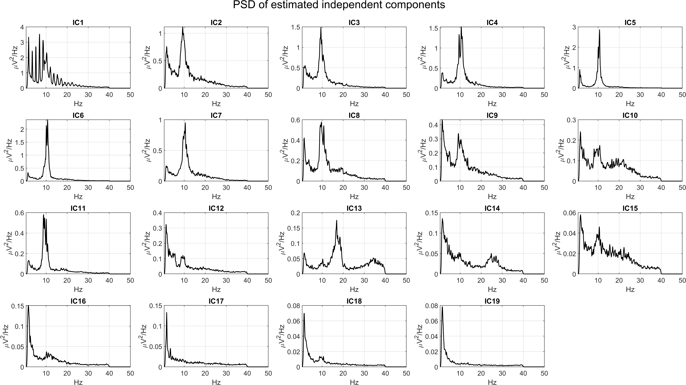

### Point 7 - IC inspection panels (time/PSD/topomap)
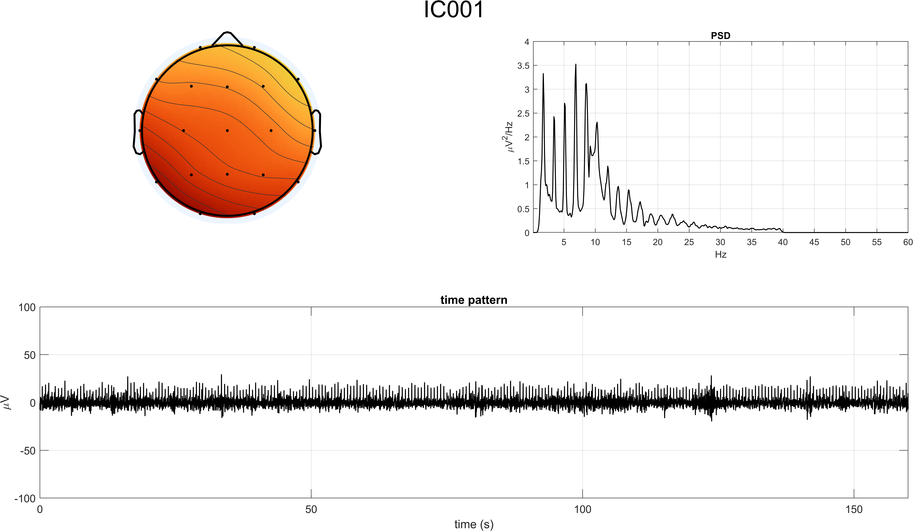
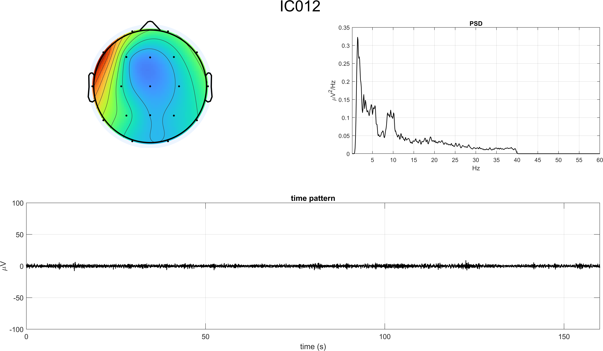
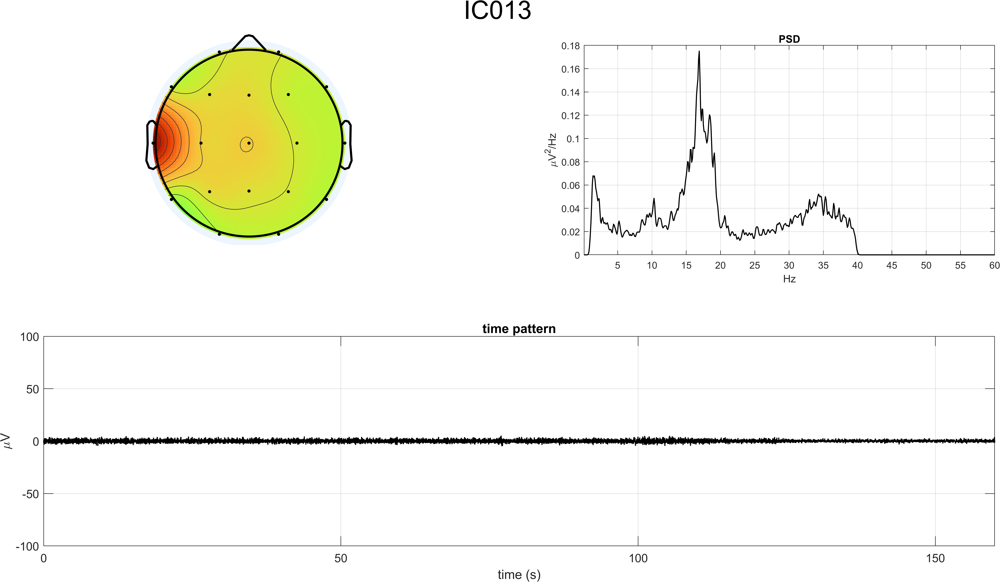
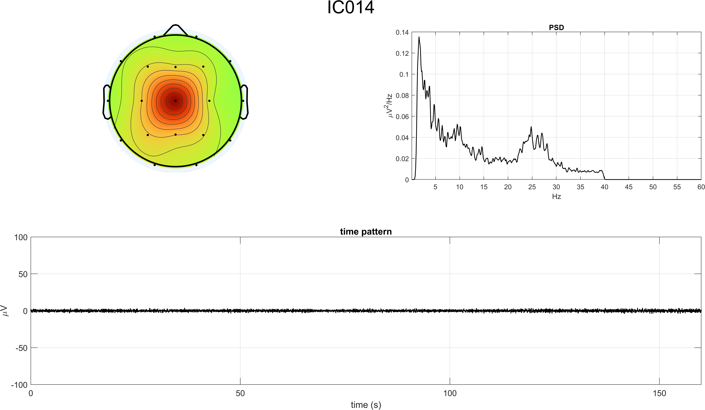
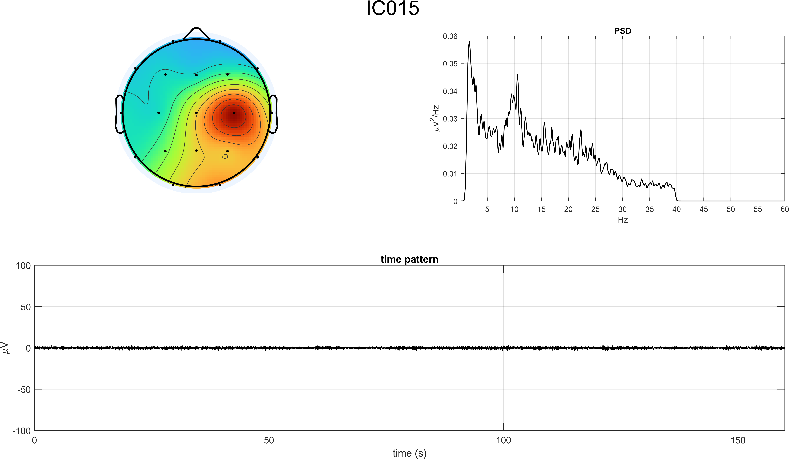
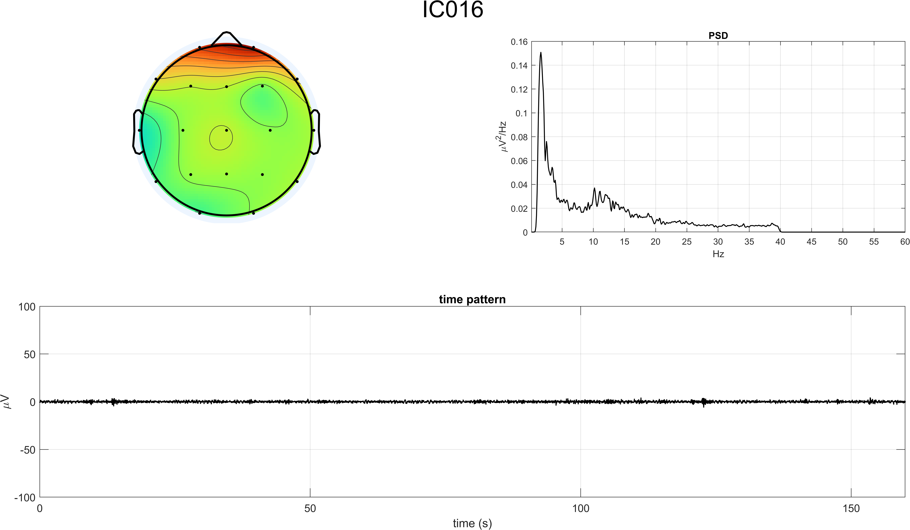
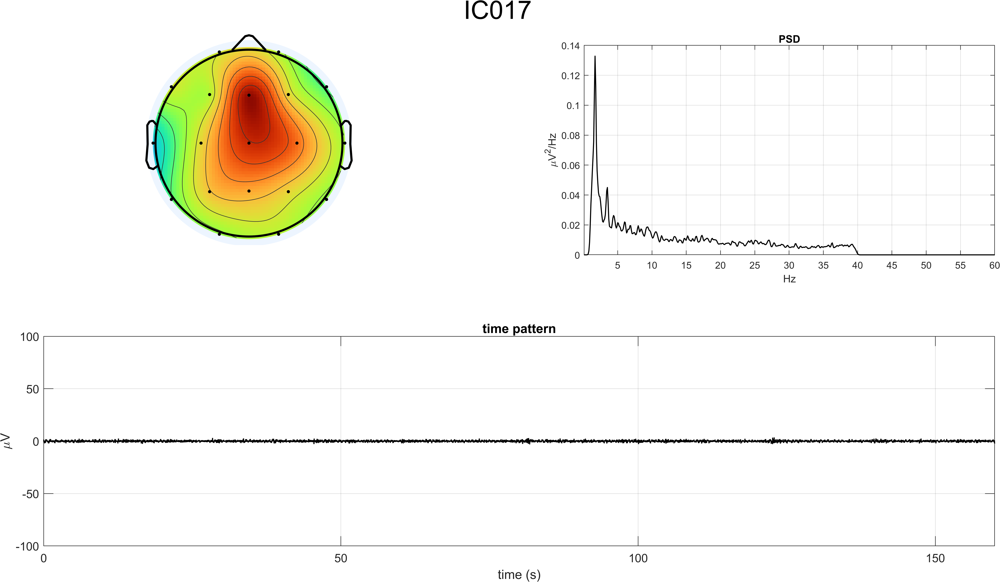
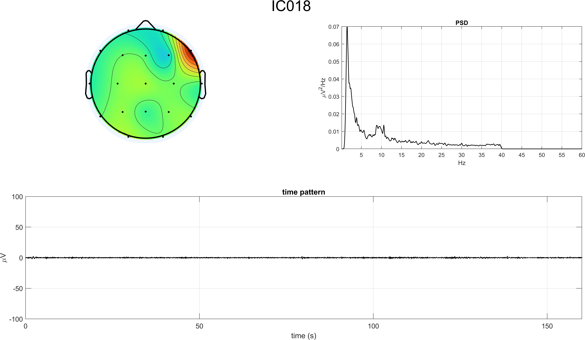
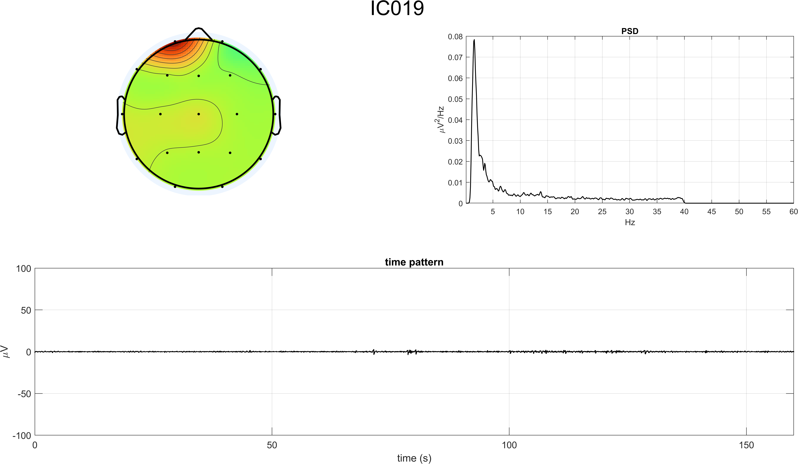

### Point 8 - Cleaned EEG and spectral comparison
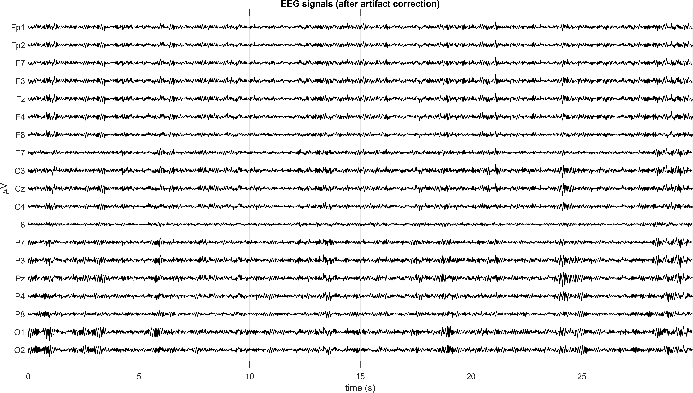
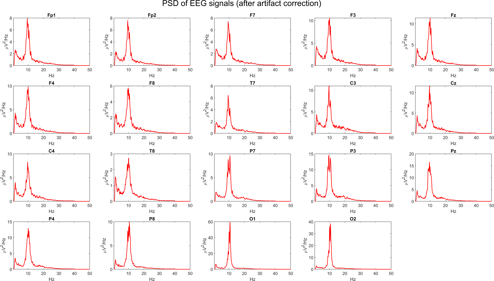
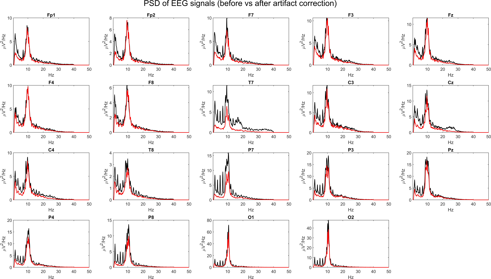

## Interpretation and Comparison with Exercise 3
- In eyes-closed data, alpha-band activity (around ~10 Hz) is more pronounced than in eyes-open data, consistent with resting-state physiology.
- Compared with Exercise 3, blinking-related frontal contamination is less dominant in this recording condition.
- ICA removal reduces residual non-neural contributions while preserving the dominant oscillatory structure, especially alpha content.
- Pre/post PSD overlays indicate cleaner spectra with preserved physiologically relevant bands.

## Conclusion
Exercise 4 confirms that the ICA-based workflow remains effective in eyes-closed recordings and highlights condition-related spectral differences versus Exercise 3. The cleaned eyes-closed EEG preserves strong alpha activity while reducing artifact contamination, producing data suitable for subsequent analyses.

