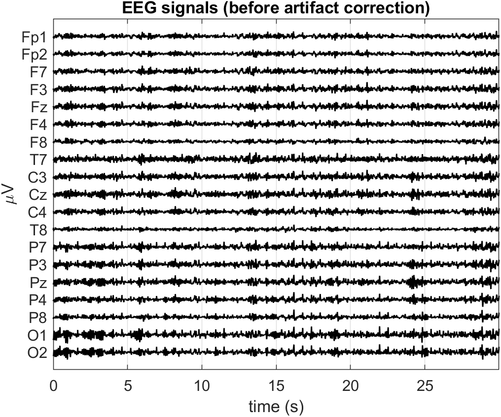
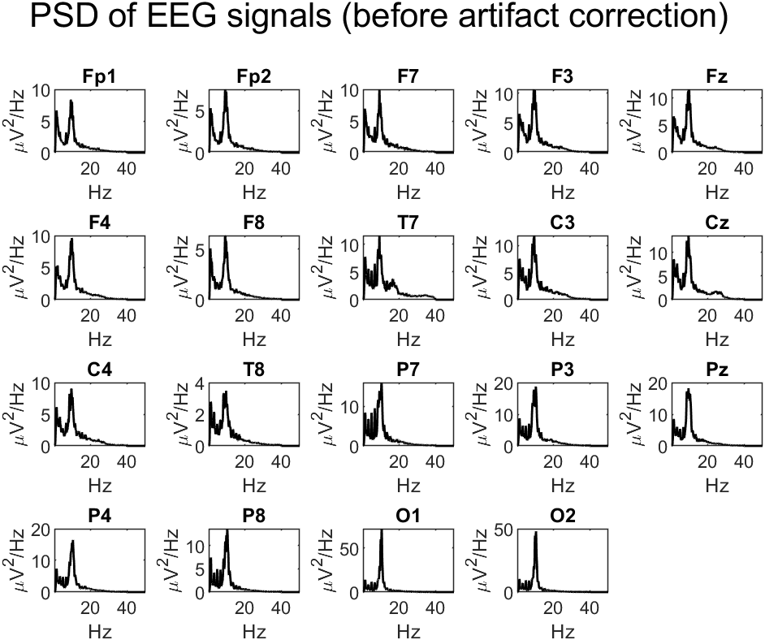
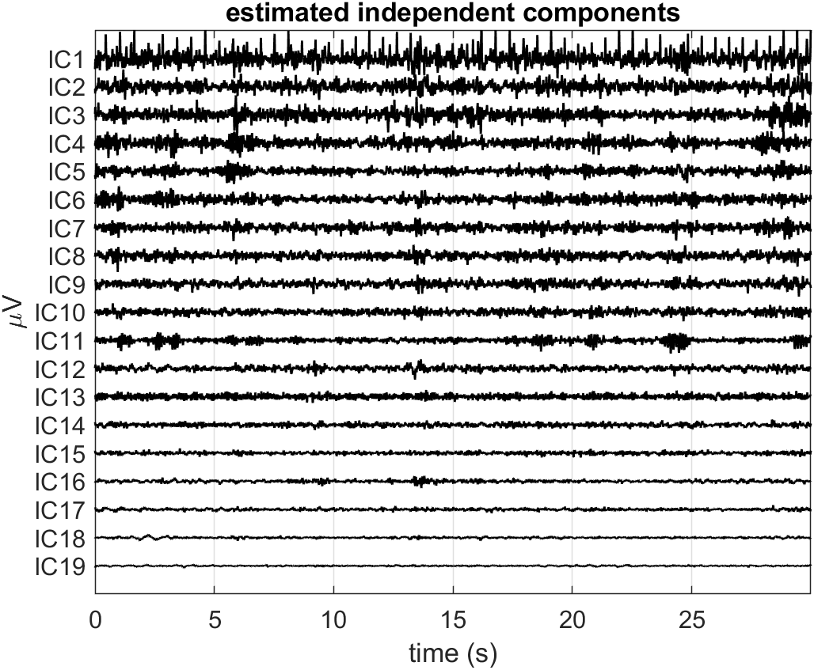
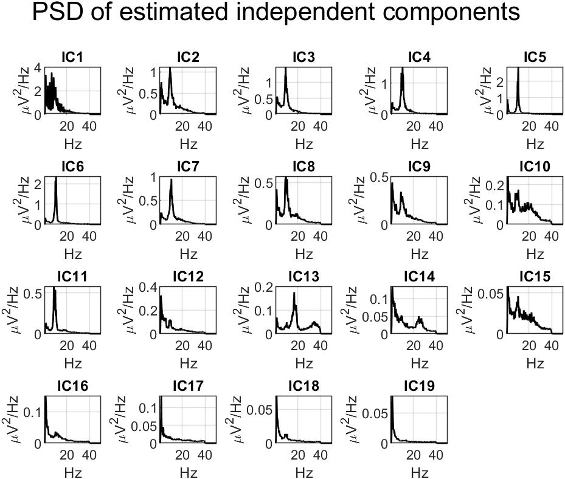
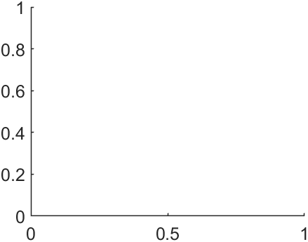

# Report: Exercise 4

## Objective
Apply ICA artifact correction to eyes-closed EEG and compare with eyes-open characteristics from Exercise 3.

## Method Summary
- Loaded 19-channel eyes-closed EEG.
- Computed channel-wise PSD and inspected alpha-band organization.
- Estimated ICA demixing matrix in EEGLAB.
- Evaluated IC time course, spectra, and topography.
- Suppressed artifact-related ICs and reconstructed cleaned EEG.

Removed components in the provided solution: IC1 and IC12-IC19.

## Results
Outputs include:
- pre-cleaning EEG and PSD organization,
- IC decomposition views,
- post-cleaning EEG and PSD overlays.

## Conclusion
The corrected eyes-closed recording preserves dominant oscillatory content (notably alpha activity) while reducing non-neural contamination.

