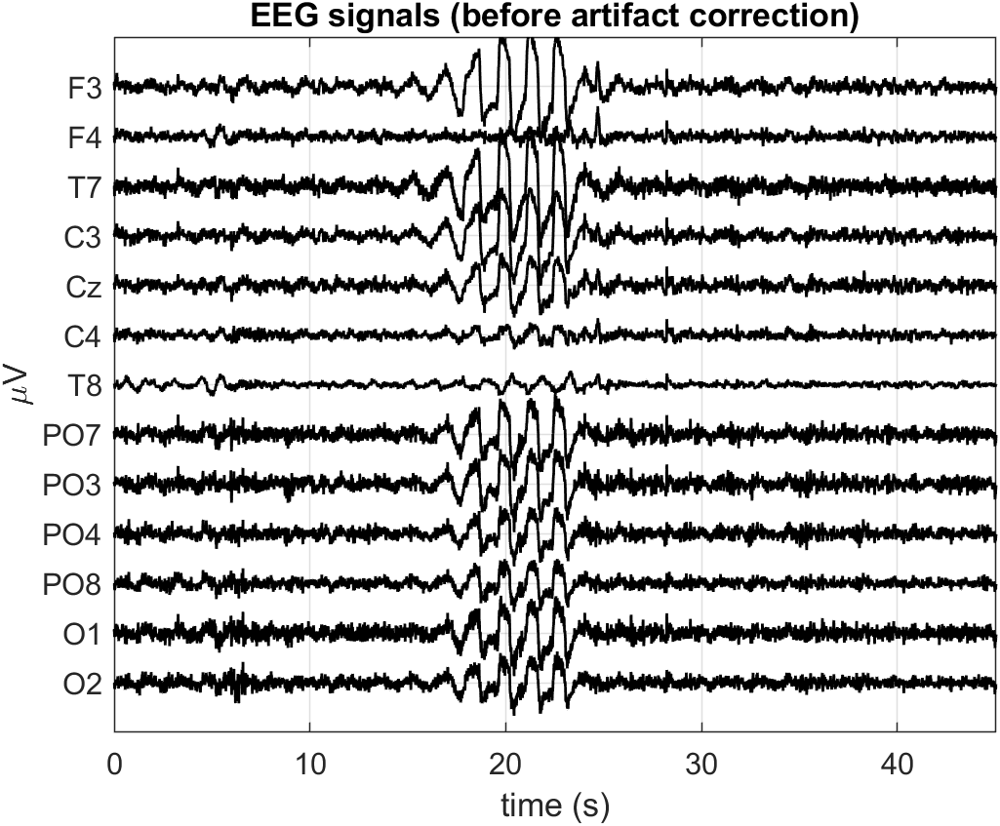
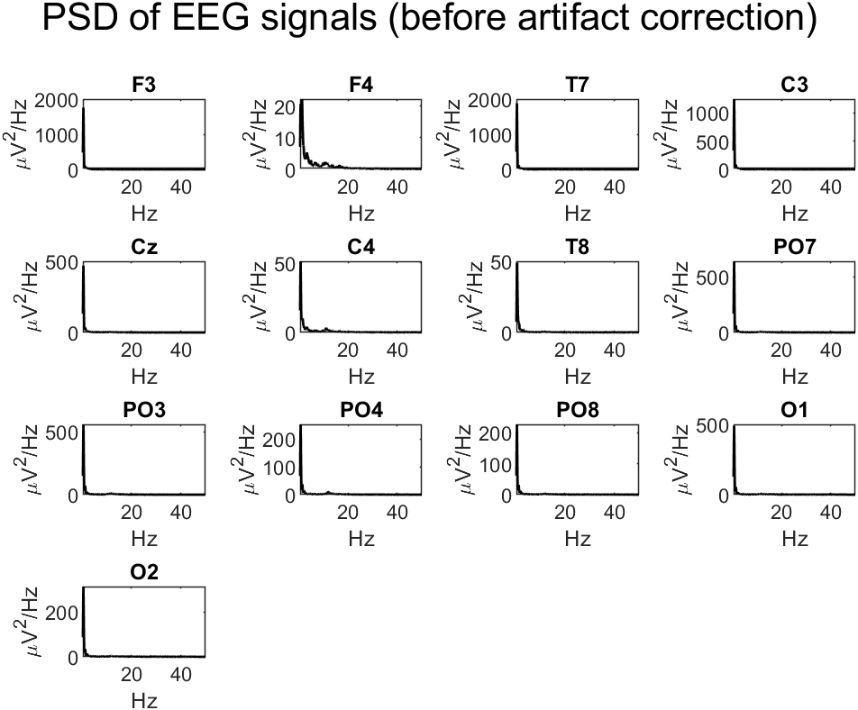
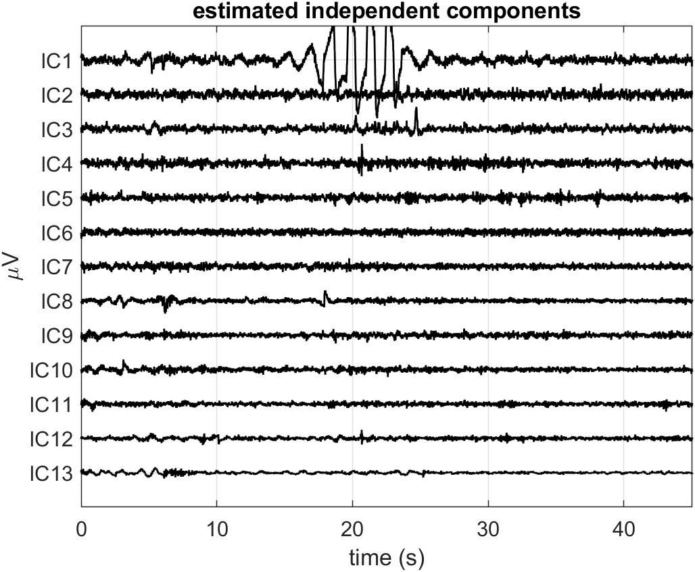
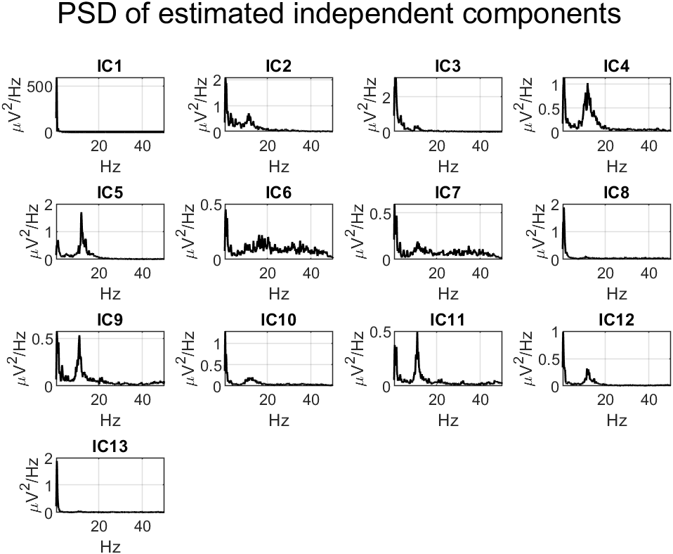
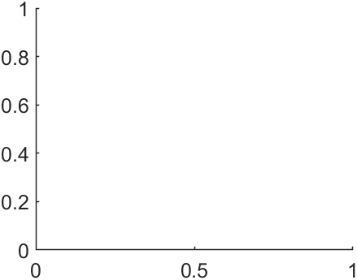

# Report: Exercise 5

## Objective
Perform ICA-based denoising on a 13-channel EEG recording and evaluate improvements in temporal and spectral domains.

## Method Summary
- Loaded 13-channel EEG dataset.
- Computed baseline PSD features.
- Estimated ICA decomposition in EEGLAB.
- Identified artifactual ICs using time pattern, PSD, and scalp map evidence.
- Reconstructed cleaned EEG after nulling selected ICs.

Removed components in the provided solution: IC1, IC3, IC6, IC7, IC8.

## Results
The figures document:
- raw signal and PSD views,
- IC decomposition,
- cleaned signal and before/after PSD comparisons.

## Conclusion
Artifact rejection via ICA improves interpretability of the EEG while maintaining meaningful channel-level spectral structure.

