# Report: Exercise 5 - ICA Cleaning on 13-Channel EEG

## Objective
Apply ICA-based artifact rejection to a 13-channel EEG recording with evident ocular contamination, then evaluate signal quality improvements in both time and frequency domains.

## Dataset and Inputs
- EEG file: `EEG_13chans.mat`
- Channels: 13
- Sampling rate: 128 Hz
- Channel locations for topography: `Standard-10-20-Cap13.locs`
- EEGLAB outputs used by script:
  - demixing matrix: `matrixW_Exercise5.txt`
  - IC topomap file: `mapICs_Exercise5.fig`

## Procedure 
1. Loaded 13-channel EEG and plotted full recording (45 s).
2. Computed/visualized PSD of all channels (`pwelch`).
3. Prepared `.mat` data export for EEGLAB.
4. In EEGLAB: estimated ICA and exported demixing matrix.
5. Reconstructed IC time courses from `Y = W*X`.
6. Computed PSD of ICs.
7. Inspected selected ICs (time/PSD/topography) to identify artifact components.
8. Removed selected artifact ICs and reconstructed cleaned EEG; compared PSD before and after correction.

## Identified Artifact Components
Based on the script inspection and comments, removed ICs:
- `IC1`: prominent lateral ocular movement artifact
- `IC3`: blink-related component
- `IC6`, `IC7`: mixed EMG/ECG-like contamination
- `IC8`: additional spurious/non-neural contribution

Removed set in reconstruction: `IC1, IC3, IC6, IC7, IC8`.

## Results and Figures (All Exported Point-by-Point)
### Point 1 - Raw 13-channel EEG (before correction)
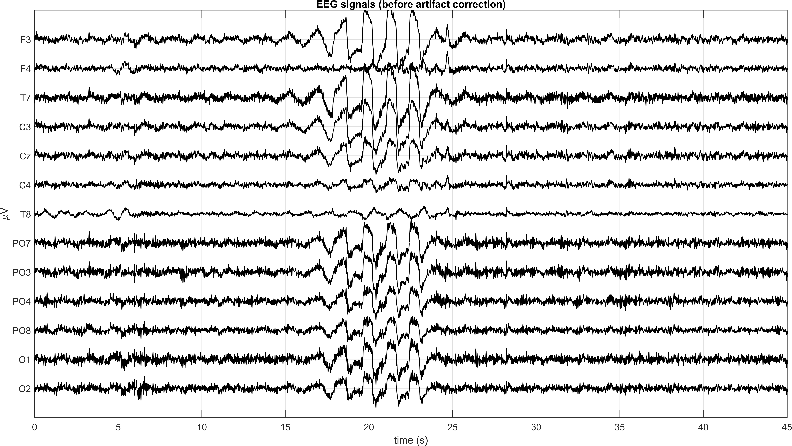

### Point 2 - PSD of raw EEG
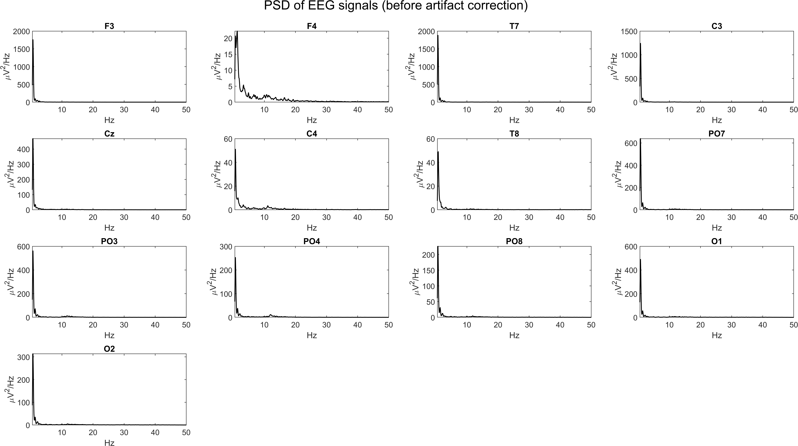

### Point 5 - Estimated ICs (time domain)
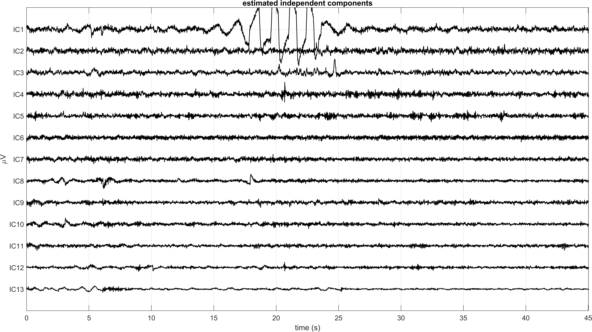

### Point 6 - PSD of ICs
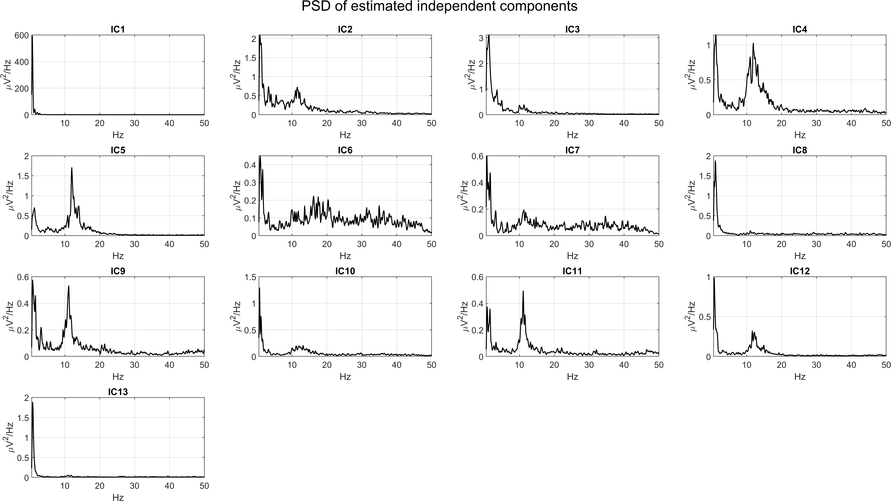

### Point 7 - Detailed IC inspection panels
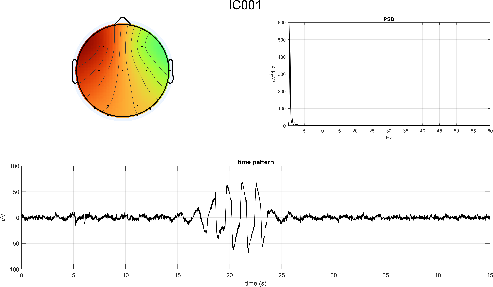
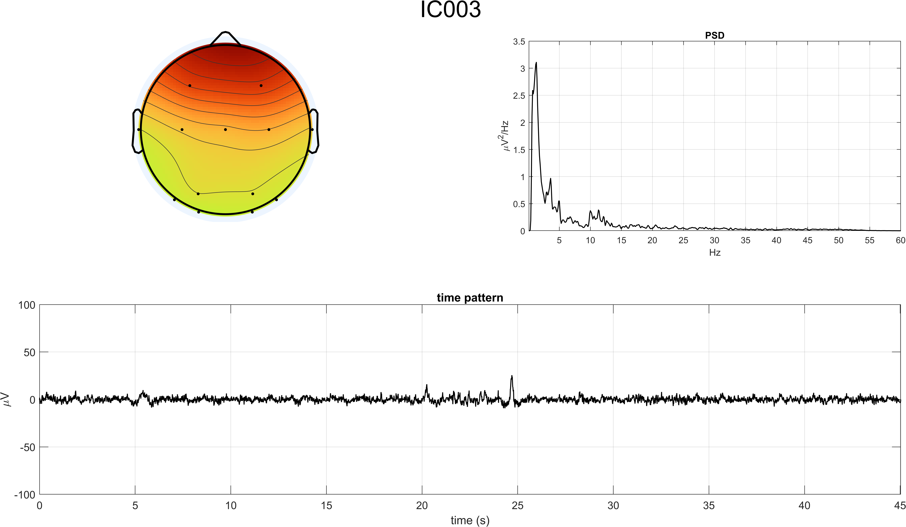
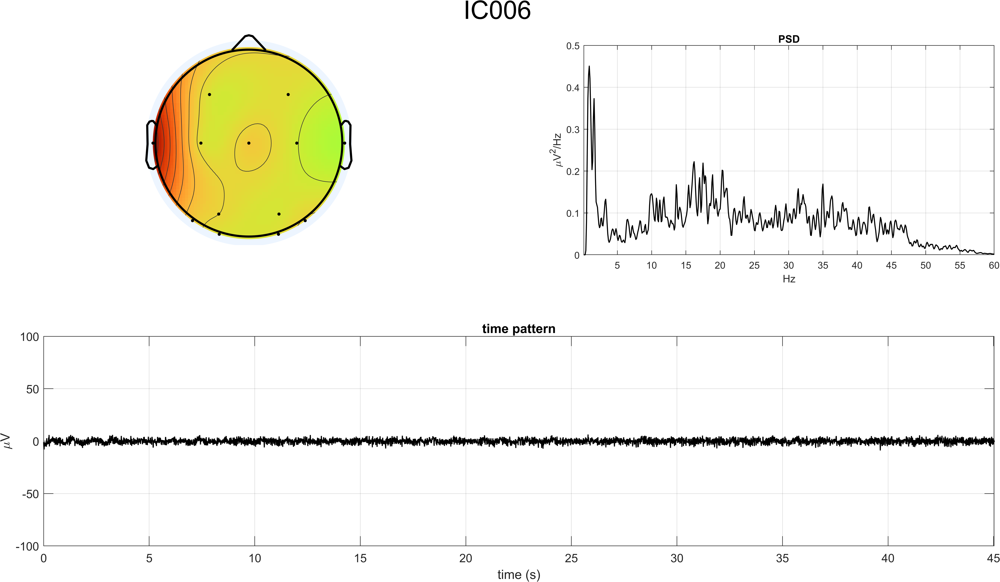
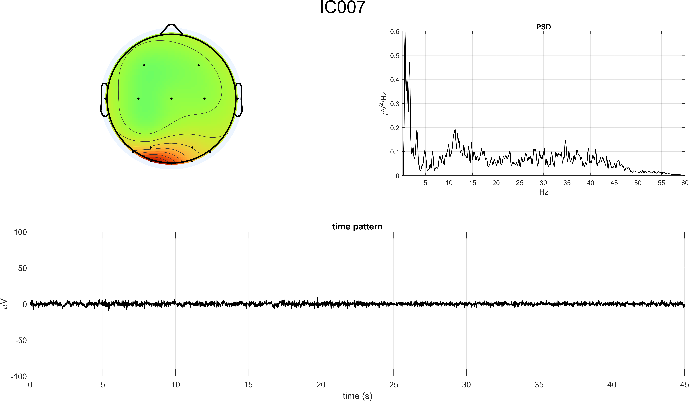
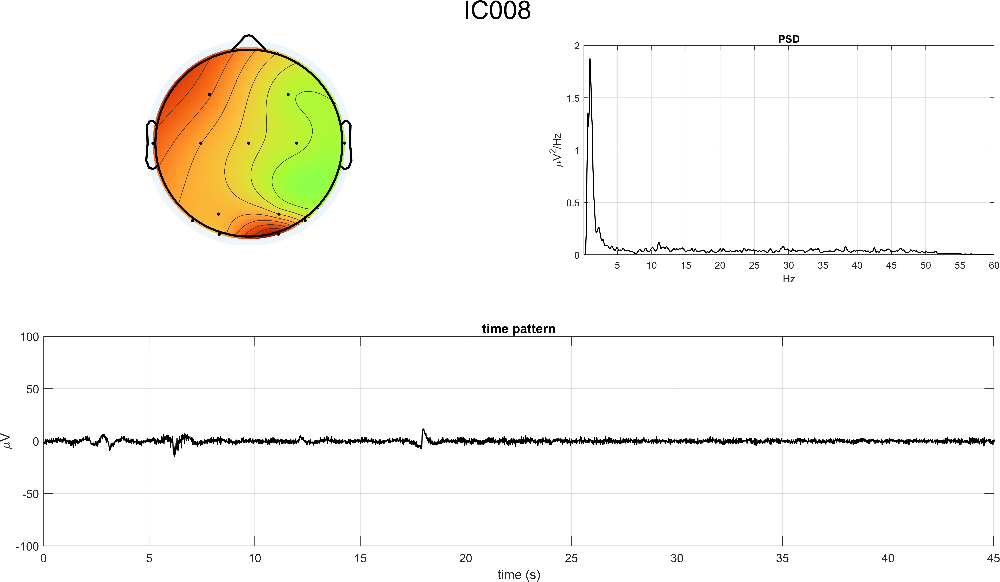

### Point 8 - Cleaned EEG and pre/post PSD comparison
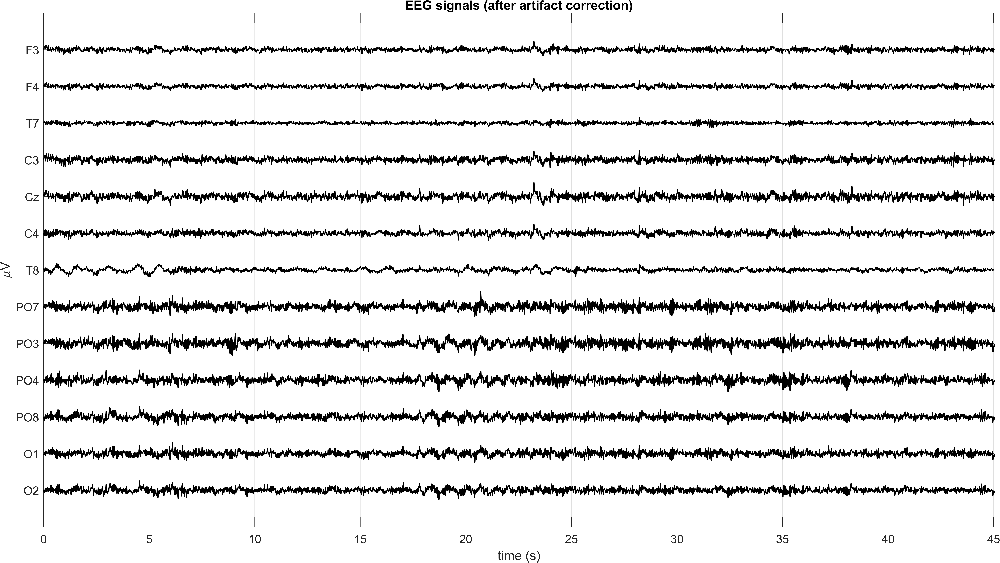
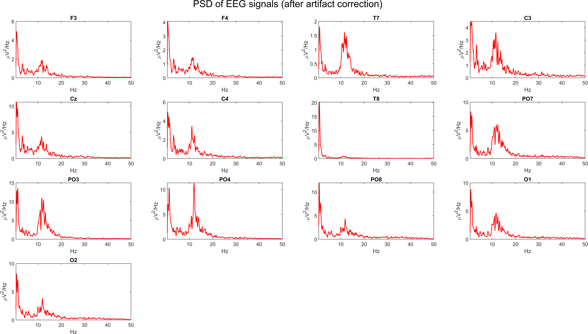
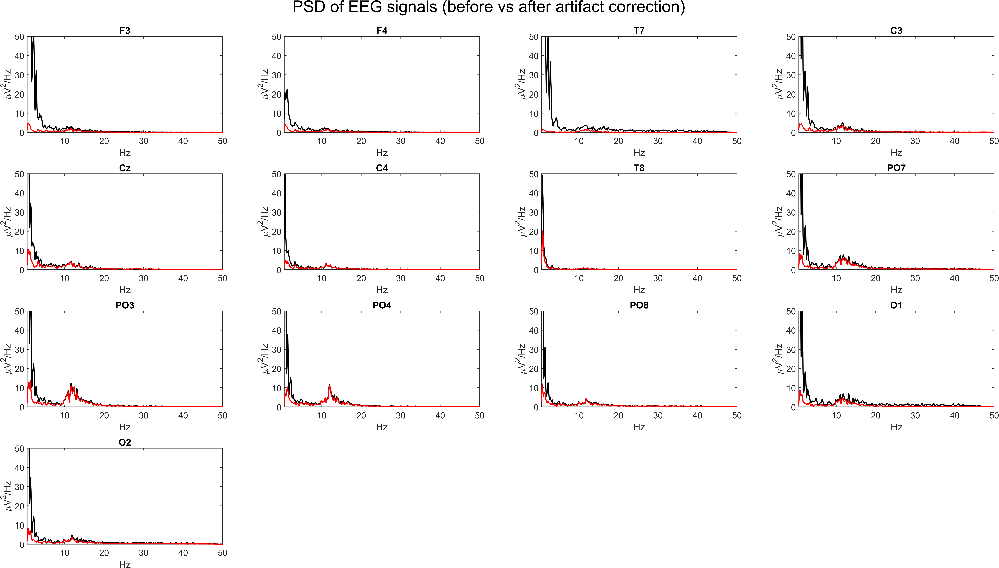

## Interpretation
- ICA isolates non-neural sources that overlap with EEG in frequency and are difficult to remove via simple filtering alone.
- After IC rejection, the time-domain traces show reduced large-amplitude ocular/motion contamination.
- PSD overlays indicate cleaner channel spectra while preserving physiologically meaningful EEG content.
- The workflow is consistent with Exercises 3 and 4, adapted here to the 13-channel montage and the stronger lateral eye-movement artifact.

## Conclusion
Exercise 5 successfully improves signal quality through ICA-based artifact rejection on a low-density montage. Removing IC1/3/6/7/8 yields cleaner EEG suitable for downstream analyses while preserving relevant neural dynamics.

