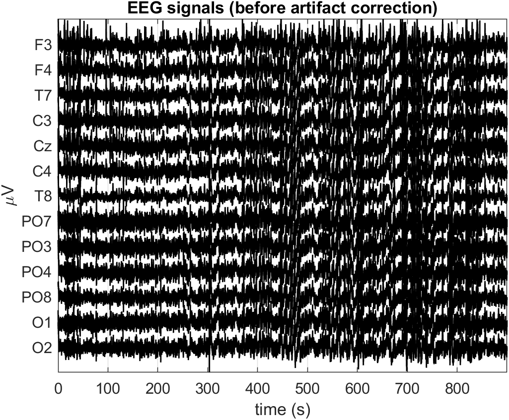
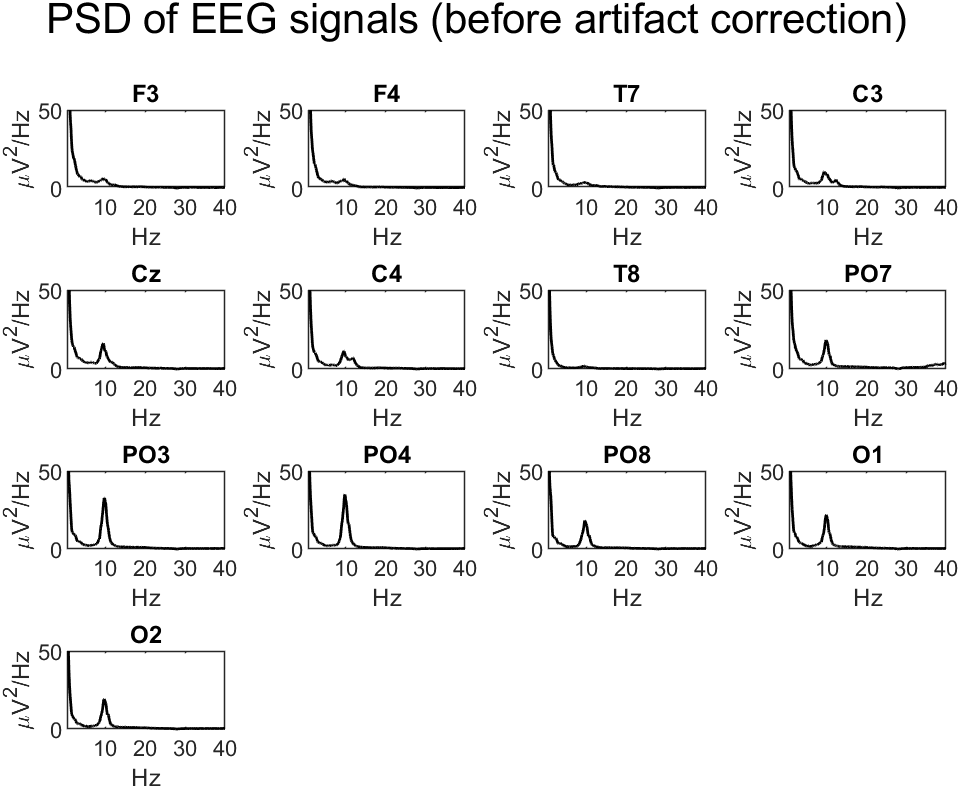
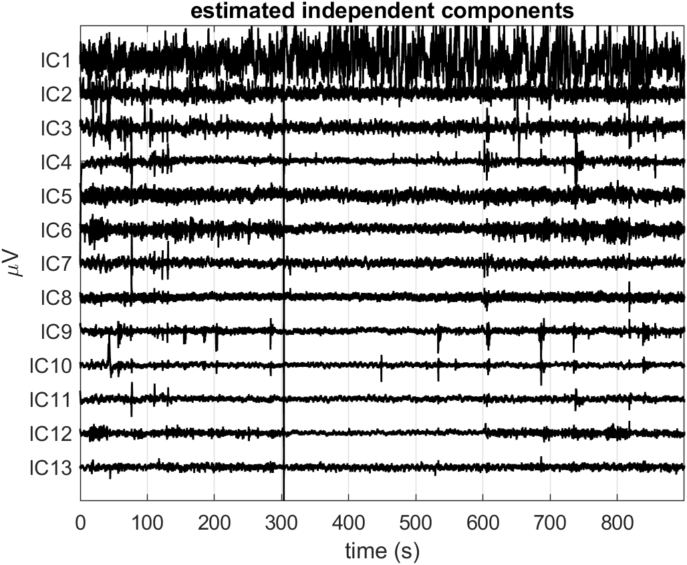
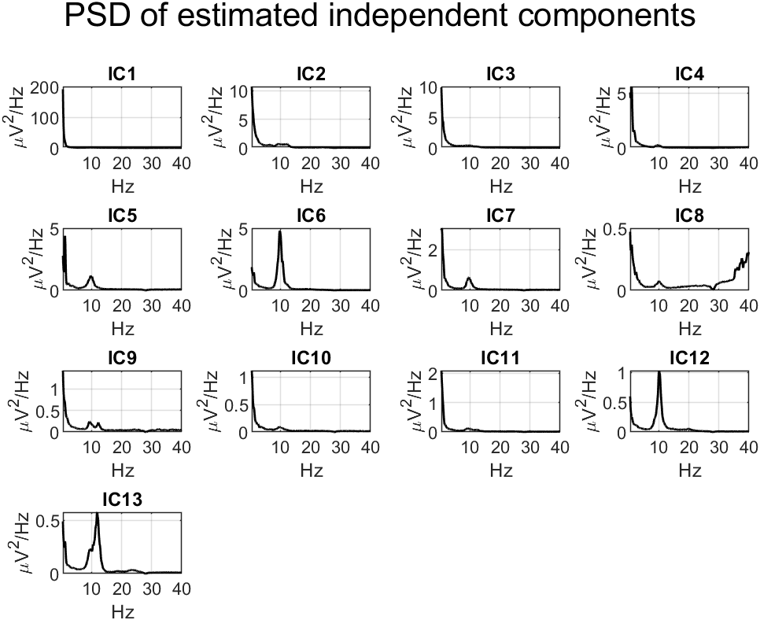
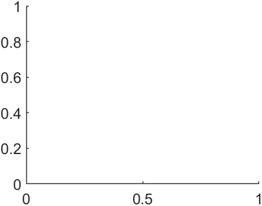

# Report: Exercise 6

## Objective
Analyze REST-TASK-REST EEG dynamics after ICA cleaning, with emphasis on regional PSD and alpha-band modulation.

## Method Summary
- Loaded 13-channel continuous EEG with three phases:
  - Relax 1 (R1),
  - Task (T),
  - Relax 2 (R2).
- Computed PSD before ICA.
- Estimated ICA components and removed major artifacts.
- Recomputed PSD on cleaned EEG globally and per phase.
- Averaged PSD across scalp regions:
  - frontal,
  - temporo-central,
  - parieto-occipital.
- Computed alpha power (8-14 Hz) by numerical integration.

Removed components in the provided solution: IC1, IC2, IC3, IC4, IC8.

## Results
The generated outputs include EEG/IC views and phase-wise spectral comparisons.

## Conclusion
The workflow captures condition-dependent spectral modulation and provides a practical template for regional alpha-power tracking in task paradigms.

