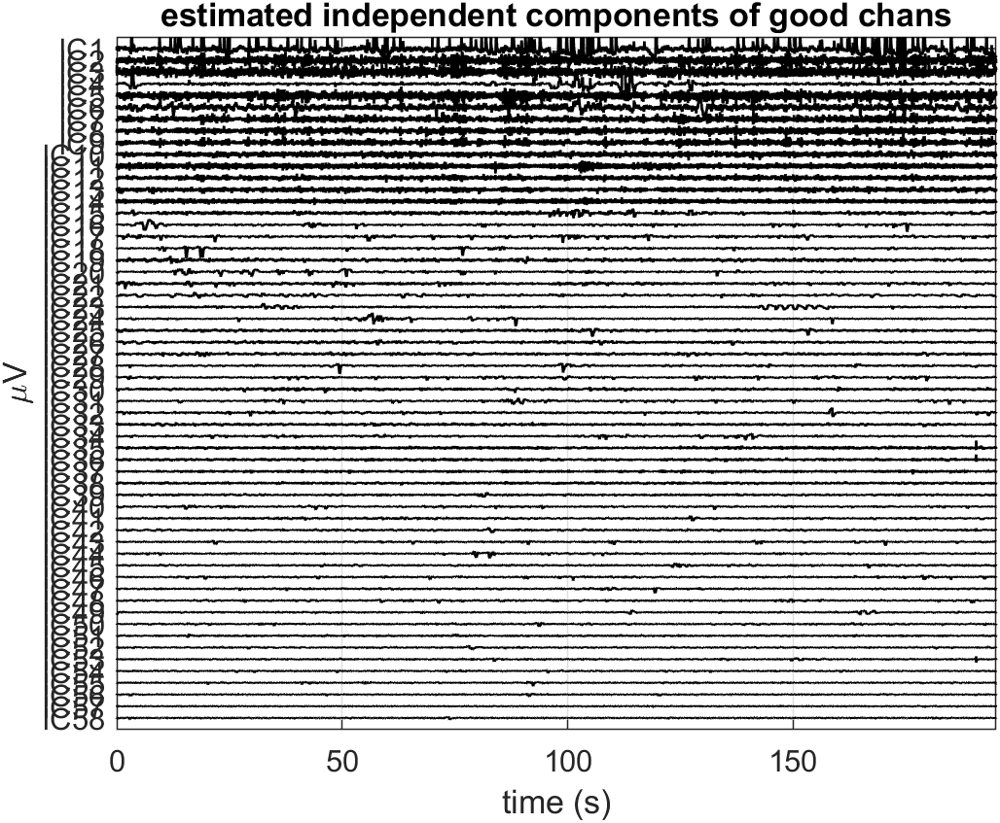
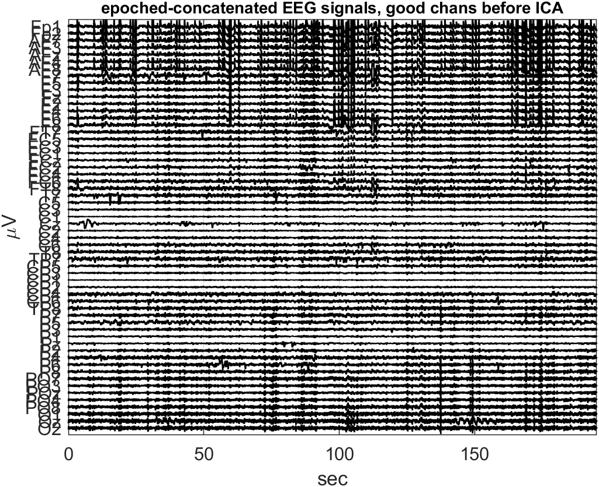
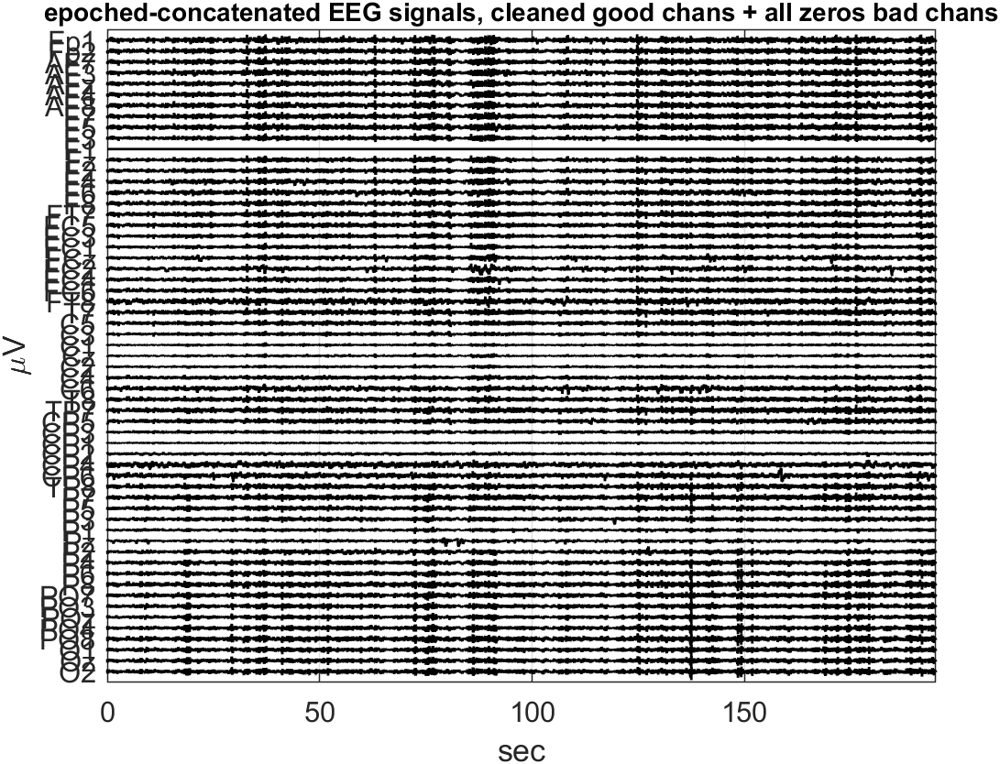
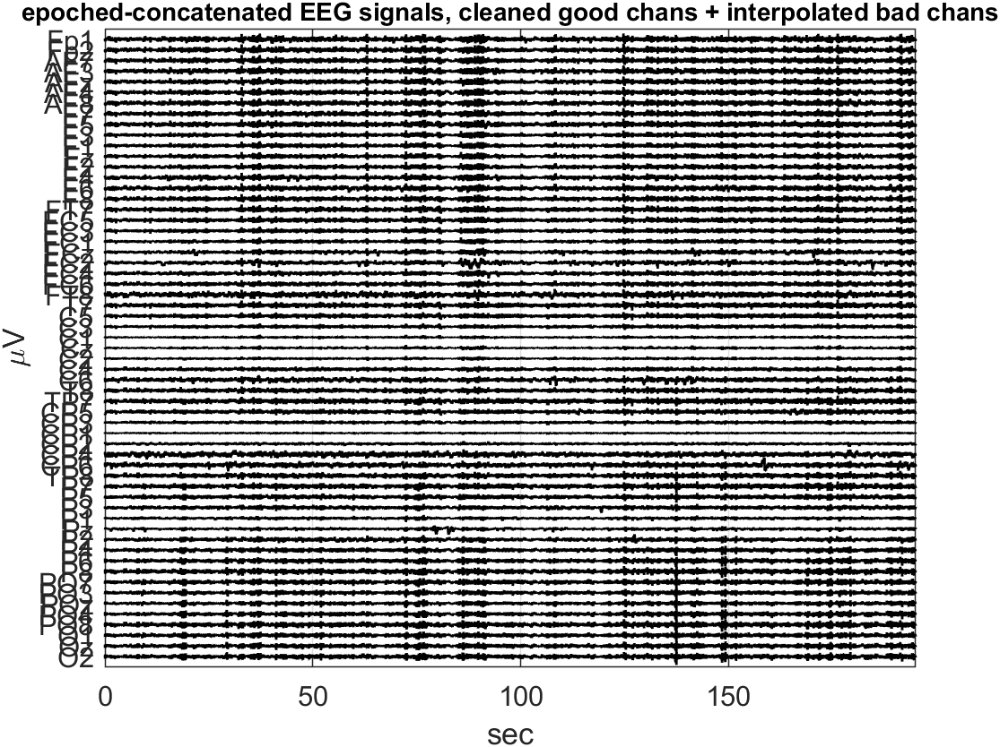
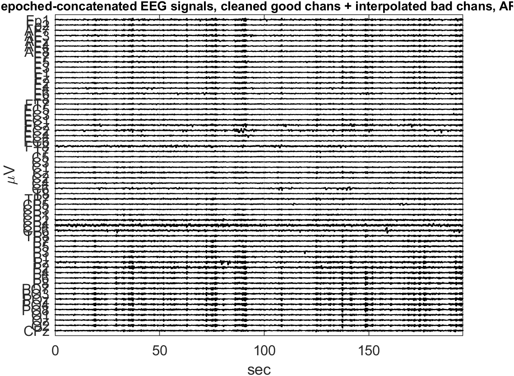
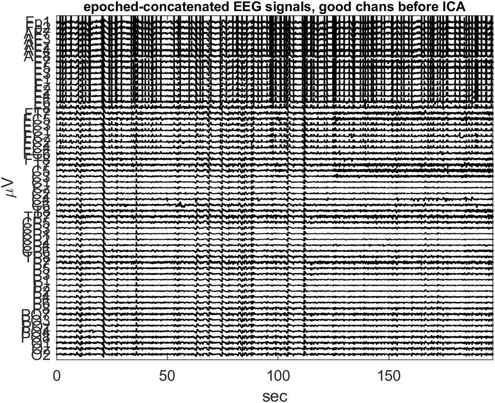
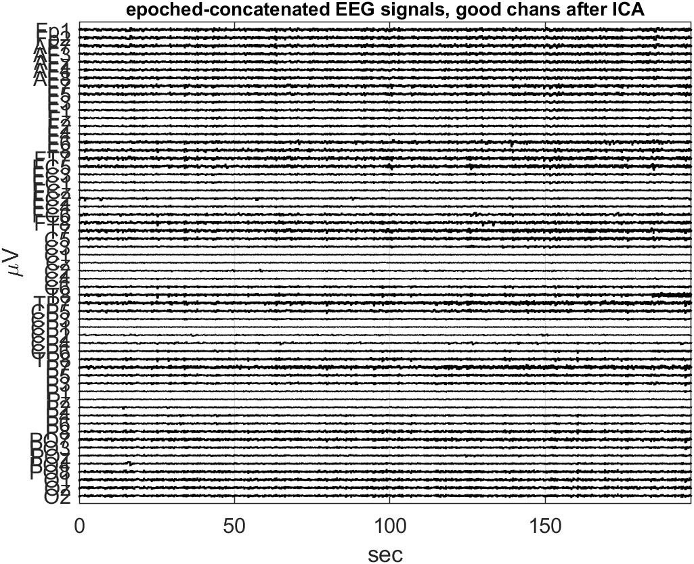
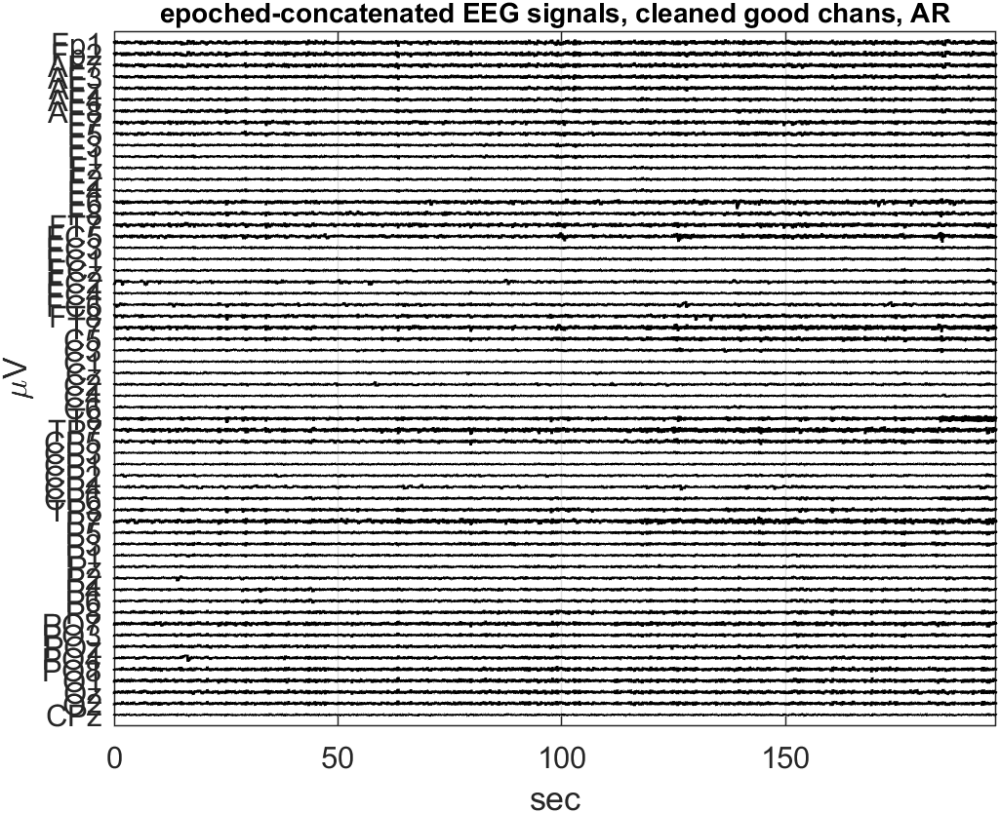

# Report: Exercise 7

## Objective
Continue subject-level preprocessing after Exercise 1 by applying ICA-based artifact rejection, bad-channel handling, and average re-referencing before saving epoched 3D datasets.

## Method Summary
Two subject pipelines are included in this folder:
- Subject 035 (`Exercise7_Solution.m`)
- Subject 003 (`Exercise7_Solution_Subj003.m`)

Main workflow:
- load epoched-concatenated data from preprocess step 1,
- estimate ICA and inspect IC temporal/spectral/topographic signatures,
- remove artifact ICs,
- reconstruct cleaned good channels,
- handle bad channels (interpolate when needed),
- add CPz and convert to average reference,
- reshape 2D concatenated data back to 3D (channels x samples x epochs).

## Results
### Subject 035

### Subject 003

## Conclusion
The resulting datasets are cleaned, re-referenced, and structurally ready for event-related and time-frequency analyses in subsequent exercises.

