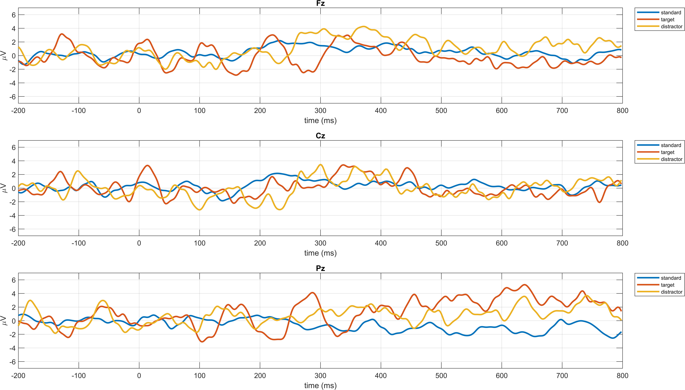
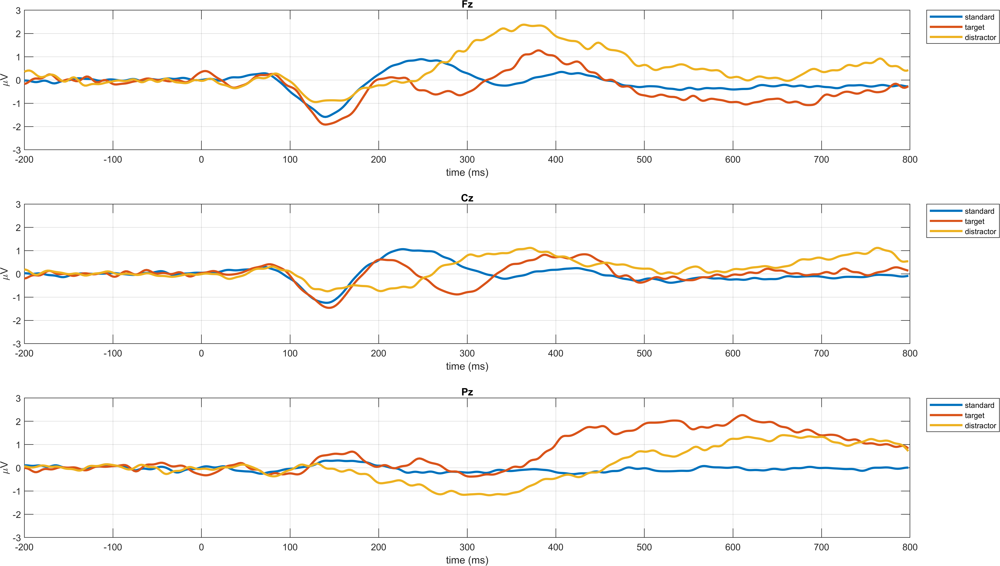

# Report: Exercise 8a and 8b - ERP Averaging (WSA and GA)

## Objective
Exercise 8 analyzes event-related potentials (ERP) after preprocessing:
- **8a:** single-subject analysis (Within-Subject Averages, WSA),
- **8b:** group-level analysis (Grand Averages, GA).

The workflow compares three stimulus classes: `standard`, `target`, and `distractor`.

## Input Data and Files
- `sub-035_PreprocessStep2.mat` and `sub-003_PreprocessStep2.mat`: cleaned, epoched EEG data from Exercise 7.
- `WSA_allsubjects.mat`: precomputed subject-level averages used for GA.
- `Standard-10-20-Cap60.locs`: electrode coordinates for topographic maps.
- `Exercise8a_Solution.m` and `Exercise8b_Solution.m`: MATLAB solutions.

## Exercise 8a (Single Subject WSA)
### Processing Steps
1. Load preprocessed 3D epoched data (`channels x samples x epochs`).
2. Apply baseline correction on the pre-stimulus interval (`-200 to 0 ms`).
3. Split epochs into `standard`, `target`, and `distractor`.
4. Compute WSA for each condition.
5. Plot ERP waveforms at **Fz (12), Cz (30), Pz (47)**.
6. Plot condition-wise scalp maps from `0` to `700 ms` (100 ms step, each map averaged over 100 ms window).

### Figures

## Exercise 8b (Grand Average Across Subjects)
### Processing Steps
1. Load `WSA_allsubjects.mat`.
2. Compute GA for each condition by averaging over subjects.
3. Plot GA waveforms at **Fz, Cz, Pz**.
4. Plot GA scalp maps from `0` to `700 ms` with the same temporal framing as 8a.

### Figures

## Short Interpretation
- Target responses are expected to show stronger late positive activity (classical oddball/P300 behavior), especially over centro-parietal areas.
- Standard and distractor responses are typically smaller in late latency windows.
- Topographic maps help verify both timing and scalp distribution differences between conditions.

## Reproducibility
Figures were exported by running each solution script **point-by-point** with:
- `tools/export_exercise8_by_point.m`

Export settings:
- PNG format,
- minimum large canvas,
- 600 DPI for report quality.

