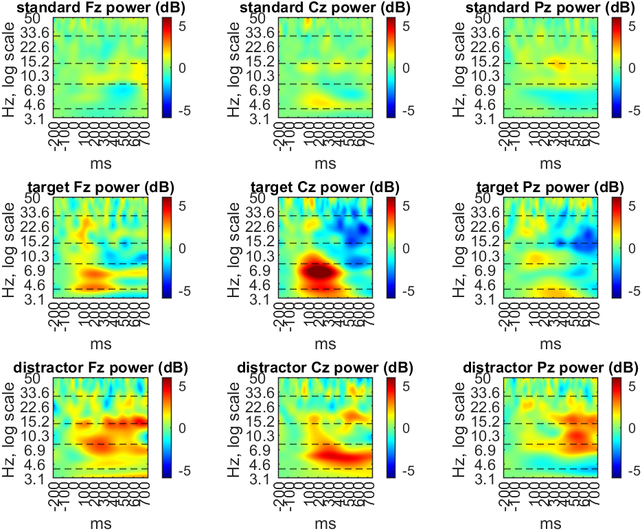
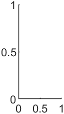

# Report: Exercise 9

## Objective
Perform event-related time-frequency analysis for three oddball conditions (standard, target, distractor), including alpha-band scalp mapping.

## Method Summary
### Part A (single-subject analysis)
- Loaded preprocessed epochs (`sub-003` or `sub-035` step-2 file).
- Applied trial-wise baseline correction.
- Split epochs by stimulus class.
- Computed wavelet time-frequency power (CWT, 3.125-50 Hz) per epoch/channel.
- Averaged across epochs by condition.
- Normalized power to baseline and visualized:
  - channel-level TF maps,
  - alpha-band (8-14 Hz) topographic evolution.

### Part B (group-average visualization)
- Script expects precomputed grand-average tensor (`TF_Power_GA.mat`).
- Produces the same TF and alpha-topography views at group level.

## Results
Available generated figures correspond to Part A:

Part B figures were not generated in this run because `TF_Power_GA.mat` was not available.

## Conclusion
The implemented pipeline supports condition-specific ERSP characterization and alpha-band spatial-temporal tracking, with group-level analysis ready once grand-average inputs are provided.

