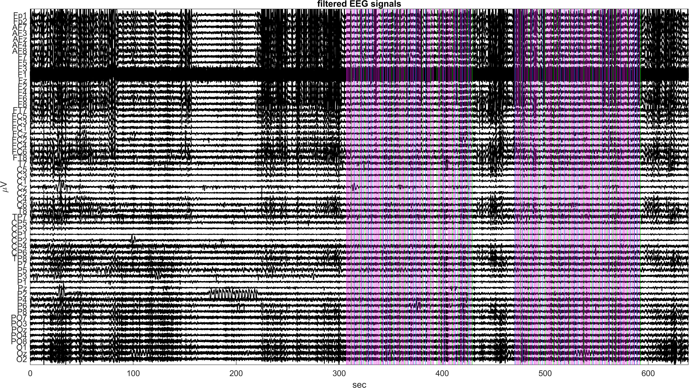
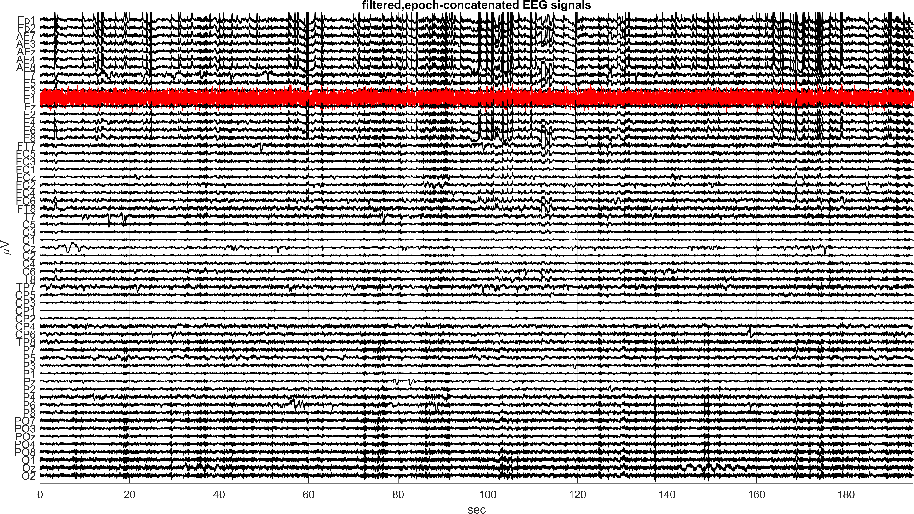

# Preprocessing

This module prepares raw EEG for downstream artifact handling and analysis. The workflow focuses on offline preprocessing decisions that are standard in practical EEG analysis: detrending, band-limited filtering, event alignment, epoch extraction, and correlation-based bad-channel screening.

## Inputs

- `sub-035_ses-01_task-Rest_eeg.mat`
- `nearby_channels.mat`

## Main Script

- `preprocessing_pipeline.m`

## Processing Summary

1. Convert the recording to double precision and detrend each channel.
2. Inspect baseline spectra with Welch PSD estimates.
3. Apply zero-phase high-pass, low-pass, and notch filtering.
4. Verify event timing against the filtered continuous recording.
5. Extract stimulus-locked epochs in `[-0.2, 0.8]` s.
6. Concatenate epochs into a 2-D matrix for subsequent ICA work.
7. Identify bad channels using nearby-channel correlation.
8. Save the first cleaned preprocessing snapshot as `sub-035_PreprocessStep1.mat`.

## Output

- `sub-035_PreprocessStep1.mat`

Key variables include the concatenated EEG matrix, retained channel labels, bad-channel indices, sampling rate, and event timing metadata needed by later modules.

## Representative Figures

## Notes

- The module is written as a reproducible preprocessing workflow rather than as a generic toolbox.
- Bad-channel handling is deliberately conservative because the downstream ICA and re-referencing steps depend on stable channel geometry.
