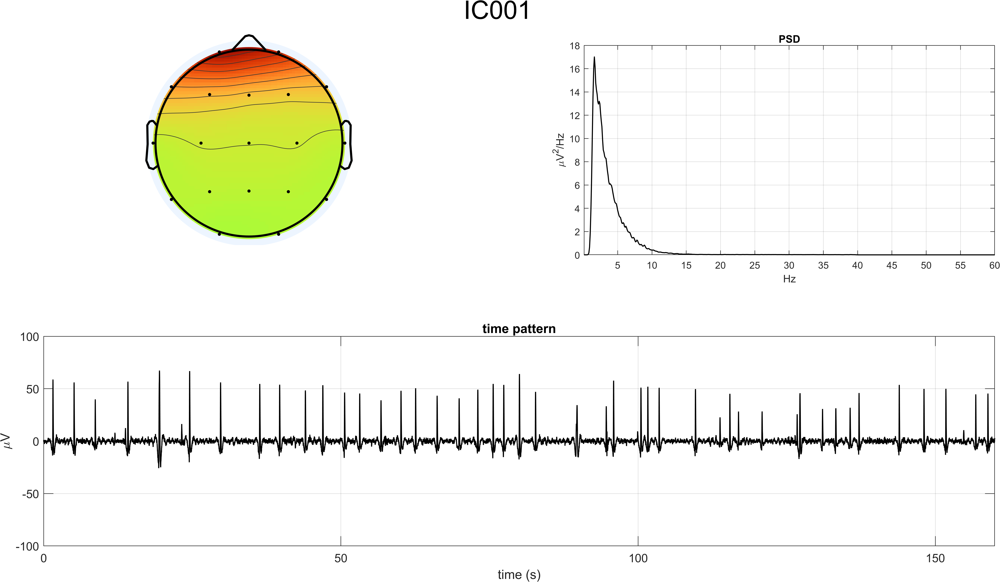
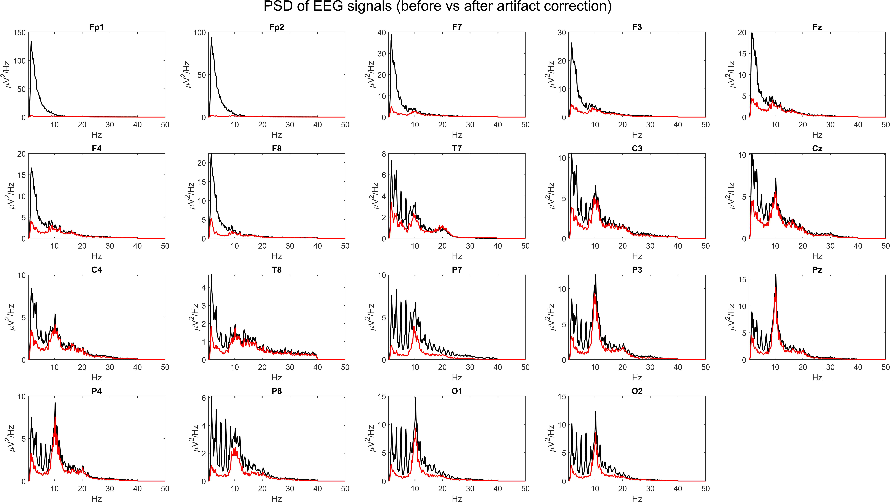

# Open-Eyes Resting-State ICA Cleaning

ICA-based artifact rejection on a 19-channel eyes-open resting-state recording.

## Inputs

- `EYES_OPEN.mat`
- `Standard-10-20-Cap19.locs`
- EEGLAB-derived `matrixW_open_eyes.txt` and `mapICs_open_eyes.fig`

## Main Script

- `ica_open_eyes_pipeline.m`

## Workflow

1. Inspect the raw recording in the time and frequency domains.
2. Export the data for EEGLAB ICA estimation.
3. Reconstruct independent components and inspect their temporal, spectral, and spatial signatures.
4. Reject the artifactual IC set and reconstruct cleaned EEG.
5. Compare pre- and post-cleaning spectra to confirm that cleanup does not erase the dominant physiological band structure.

## Removed Components

- `IC1`, `IC2`, `IC19`

## Representative Figures

## Notes

This case study is useful as a compact demonstration of the repository's ICA inspection logic before moving to the larger preprocessing-completion branch.
