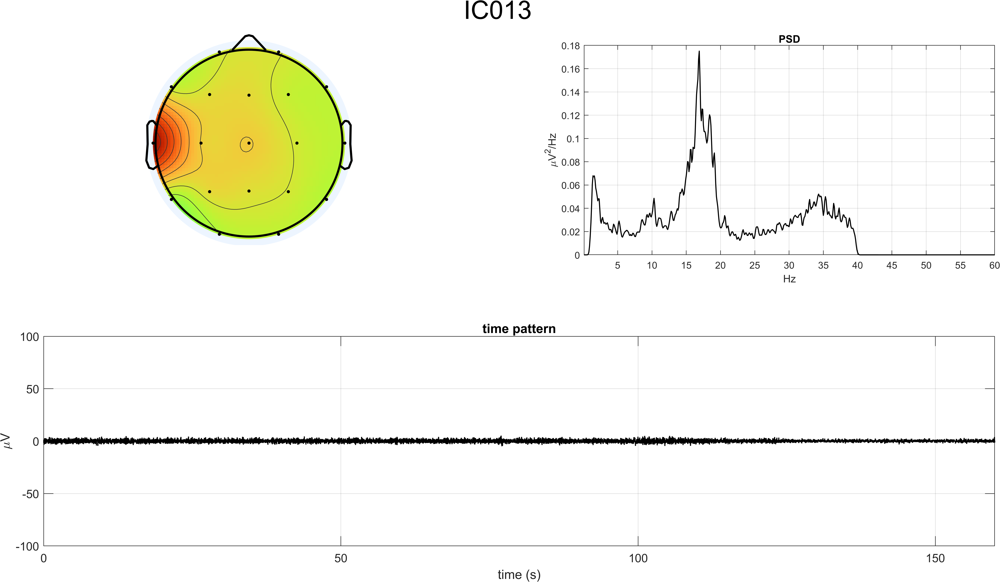

# Closed-Eyes Resting-State ICA Cleaning

ICA artifact rejection on a 19-channel eyes-closed resting-state recording.

## Inputs

- `EYES_CLOSED.mat`
- `Standard-10-20-Cap19.locs`
- EEGLAB-derived `matrixW_closed_eyes.txt` and `mapICs_closed_eyes.fig`

## Main Script

- `ica_closed_eyes_pipeline.m`

## Workflow

1. Inspect the raw recording and its channel-wise PSD.
2. Export the EEG to EEGLAB and estimate ICA.
3. Reconstruct IC time courses and inspect temporal, spectral, and topographic evidence.
4. Remove the artifactual IC set and rebuild cleaned EEG.
5. Compare signal traces and spectra before and after correction.

## Representative Figures

## Notes

Compared with the eyes-open case, this workflow is helpful for showing how artifact interpretation changes with recording condition while the core ICA logic stays consistent.
