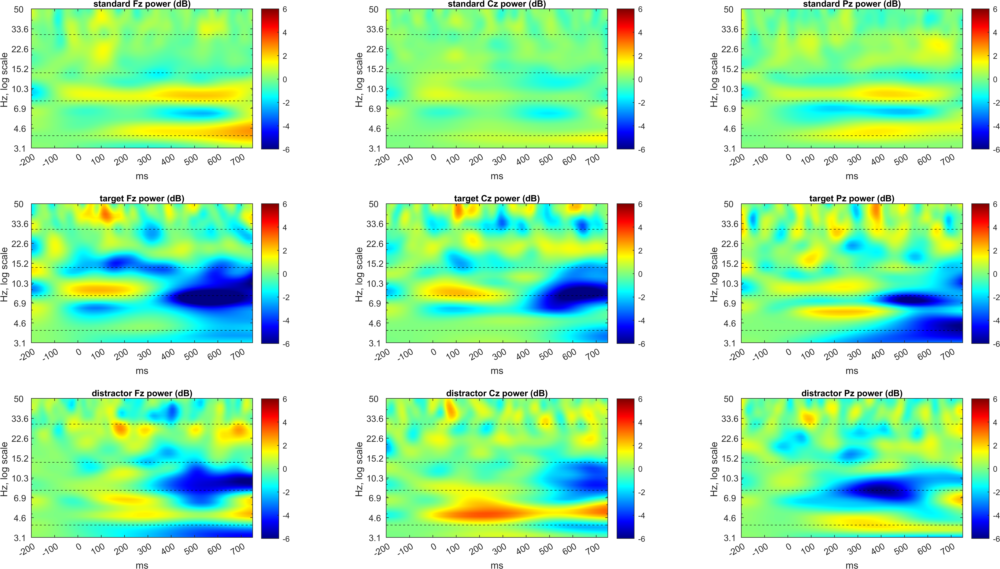

# Time-Frequency Analysis

This module extends the cleaned EEG workflow into the time-frequency domain using continuous wavelet transforms. It emphasizes condition-dependent power changes and alpha-band spatial evolution after preprocessing and artifact handling are complete.

## Inputs

- `sub-003_PreprocessStep2.mat`
- `sub-035_PreprocessStep2.mat`
- `TF_Power_GA.mat`
- `Standard-10-20-Cap60.locs`

## Main Scripts

- `tf_subject_analysis_cwt.m`
- `tf_group_analysis_cwt.m`

## Processing Summary

1. Baseline-correct cleaned epochs.
2. Estimate time-frequency power with CWT.
3. Average condition-wise power for each subject.
4. Normalize power relative to the pre-stimulus baseline.
5. Inspect channel-level spectrograms and alpha-band topographies.
6. Compare subject-level and group-level behavior.

## Representative Figures

## Notes

This module complements the ERP branch by showing frequency-specific dynamics that are not visible in time-domain averages alone.
